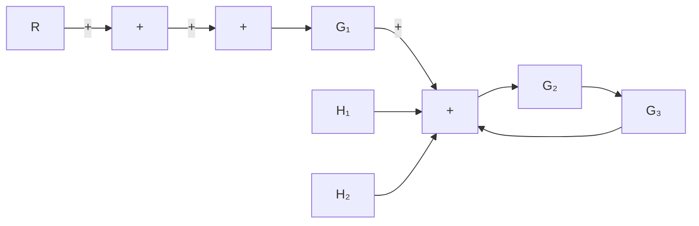
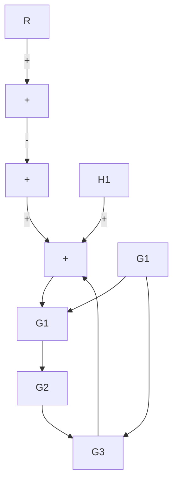
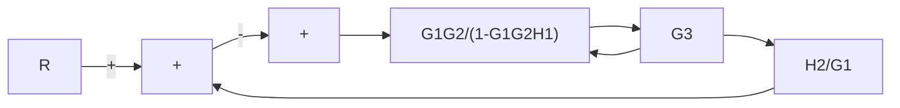
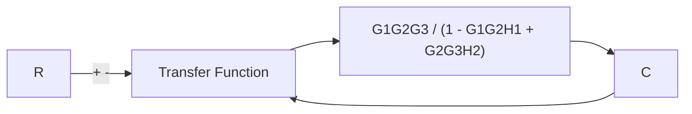
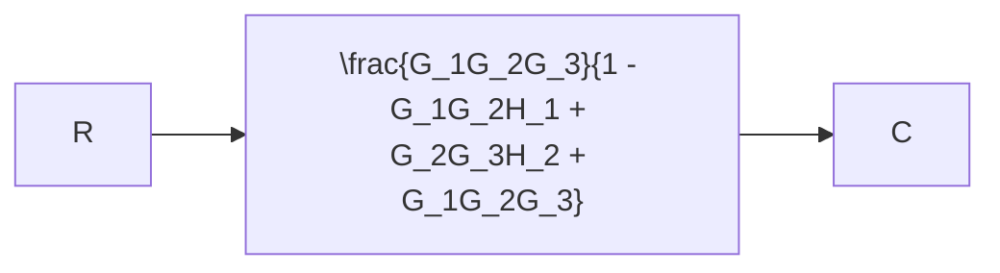

# EXAMPLE 2–1

Consider the system shown in Figure 2–13(a). Simplify this diagram.

By moving the summing point of the negative feedback loop containing $H _ { 2 }$ outside the positive feedback loop containing $H _ { 1 } ,$ , we obtain Figure 2–13(b). Eliminating the positive feedback loop, we have Figure 2–13(c).The elimination of the loop containing $H _ { 2 } / G _ { 1 }$ gives Figure 2–13(d). Finally, eliminating the feedback loop results in Figure 2–13(e).

flowchart

flowchart

flowchart

flowchart

flowchart

Figure 2–13 (a) Multiple-loop system; (b)–(e) successive reductions of the block diagram shown in (a).

Notice that the numerator of the closed-loop transfer function $C ( s ) / R ( s )$ is the product of the transfer functions of the feedforward path. The denominator of $C ( s ) / R ( s )$ is equal to

$$1 + \sum (\text { product of the transfer functions around each loop })= 1 + \left(- G _ {1} G _ {2} H _ {1} + G _ {2} G _ {3} H _ {2} + G _ {1} G _ {2} G _ {3}\right)= 1 - G _ {1} G _ {2} H _ {1} + G _ {2} G _ {3} H _ {2} + G _ {1} G _ {2} G _ {3}$$

(The positive feedback loop yields a negative term in the denominator.)
