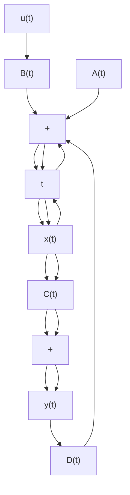

\mathbf {y} (t) = \left[ \begin{array}{c} y _ {1} (t) \\ y _ {2} (t) \\ . \\ . \\ . \\ y _ {m} (t) \end{array} \right], \quad \mathbf {g} (\mathbf {x}, \mathbf {u}, t) = \left[ \begin{array}{c} g _ {1} \bigl (x _ {1}, x _ {2}, \ldots , x _ {n}; u _ {1}, u _ {2}, \ldots , u _ {r}; t \bigr) \\ g _ {2} \bigl (x _ {1}, x _ {2}, \ldots , x _ {n}; u _ {1}, u _ {2}, \ldots , u _ {r}; t \bigr) \\ . \\ . \\ . \\ g _ {m} \bigl (x _ {1}, x _ {2}, \ldots , x _ {n}; u _ {1}, u _ {2}, \ldots , u _ {r}; t \bigr) \end{array} \right], \quad \mathbf {u} (t) = \left[ \begin{array}{c} u _ {1} (t) \\ u _ {2} (t) \\ . \\ . \\ . \\ u _ {r} (t) \end{array} \right]
$$

then Equations (2–8) and (2–9) become

$$\dot {\mathbf {x}} (t) = \mathbf {f} (\mathbf {x}, \mathbf {u}, t) \tag {2-10}\mathbf {y} (t) = \mathbf {g} (\mathbf {x}, \mathbf {u}, t) \tag {2-11}$$

where Equation (2–10) is the state equation and Equation (2–11) is the output equation. If vector functions f and/or g involve time t explicitly, then the system is called a timevarying system.

If Equations (2–10) and (2–11) are linearized about the operating state, then we have the following linearized state equation and output equation:

$$\dot {\mathbf {x}} (t) = \mathbf {A} (t) \mathbf {x} (t) + \mathbf {B} (t) \mathbf {u} (t) \tag {2-12}\mathbf {y} (t) = \mathbf {C} (t) \mathbf {x} (t) + \mathbf {D} (t) \mathbf {u} (t) \tag {2-13}$$

where A(t) is called the state matrix, B(t) the input matrix, C(t) the output matrix, and D(t) the direct transmission matrix. (Details of linearization of nonlinear systems about the operating state are discussed in Section 2–7.) A block diagram representation of Equations (2–12) and (2–13) is shown in Figure 2–14.

Figure 2–14 Block diagram of the linear, continuoustime control system represented in state space.   

flowchart

If vector functions f and g do not involve time t explicitly then the system is called a time-invariant system. In this case, Equations (2–12) and (2–13) can be simplified to

$$\dot {\mathbf {x}} (t) = \mathbf {A} \mathbf {x} (t) + \mathbf {B} \mathbf {u} (t) \tag {2-14}\dot {\mathbf {y}} (t) = \mathbf {C} \mathbf {x} (t) + \mathbf {D} \mathbf {u} (t) \tag {2-15}$$

Equation (2–14) is the state equation of the linear, time-invariant system and Equation (2–15) is the output equation for the same system. In this book we shall be concerned mostly with systems described by Equations (2–14) and (2–15).

In what follows we shall present an example for deriving a state equation and output equation.
