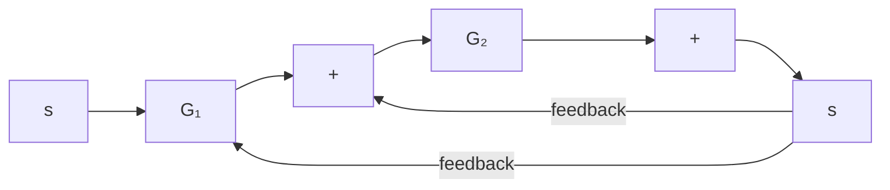
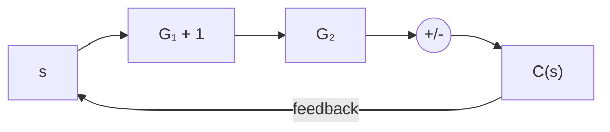
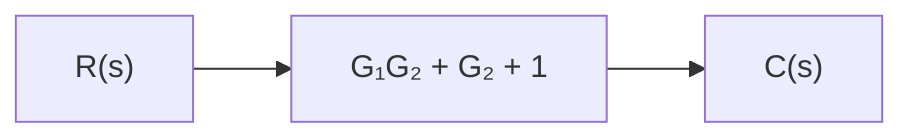

# EXAMPLE PROBLEMS AND SOLUTIONS

A–2–1. Simplify the block diagram shown in Figure 2–17.

Solution. First, move the branch point of the path involving $H _ { 1 }$ outside the loop involving $H _ { 2 }$ , as shown in Figure 2–18(a). Then eliminating two loops results in Figure 2–18(b). Combining two blocks into one gives Figure 2–18(c).

A–2–2. Simplify the block diagram shown in Figure 2–19. Obtain the transfer function relating C(s) and $R ( s )$ .

Figure 2–17 Block diagram of a system.   
  
Figure 2–18   
Simplified block diagrams for the system shown in Figure 2–17.

Figure 2–19 Block diagram of a system.

flowchart

flowchart

flowchart

(c)   
Figure 2–20 Reduction of the block diagram shown in Figure 2–19.

Solution. The block diagram of Figure 2–19 can be modified to that shown in Figure 2–20(a). Eliminating the minor feedforward path, we obtain Figure 2–20(b), which can be simplified to Figure 2–20(c). The transfer function $C ( s ) / R ( s )$ is thus given by

$$\frac {C (s)}{R (s)} = G _ {1} G _ {2} + G _ {2} + 1$$

The same result can also be obtained by proceeding as follows: Since signal X(s) is the sum of two signals $G _ { 1 } R ( s )$ and $R ( s )$ , we have

$$X (s) = G _ {1} R (s) + R (s)$$

The output signal C(s) is the sum of $G _ { 2 } X ( s )$ and $R ( s )$ . Hence

$$C (s) = G _ {2} X (s) + R (s) = G _ {2} \left[ G _ {1} R (s) + R (s) \right] + R (s)$$

And so we have the same result as before:

$$\frac {C (s)}{R (s)} = G _ {1} G _ {2} + G _ {2} + 1$$

A–2–3. Simplify the block diagram shown in Figure 2–21. Then obtain the closed-loop transfer function $C ( s ) / R ( s )$ .
