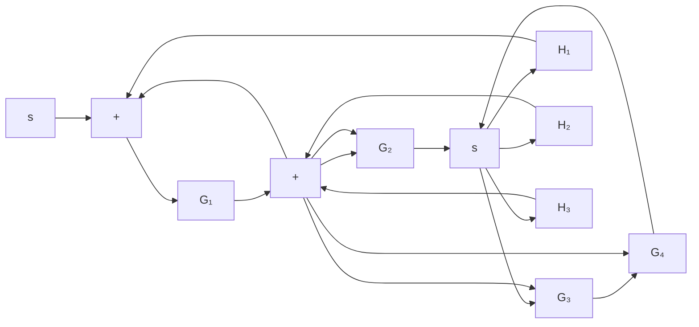
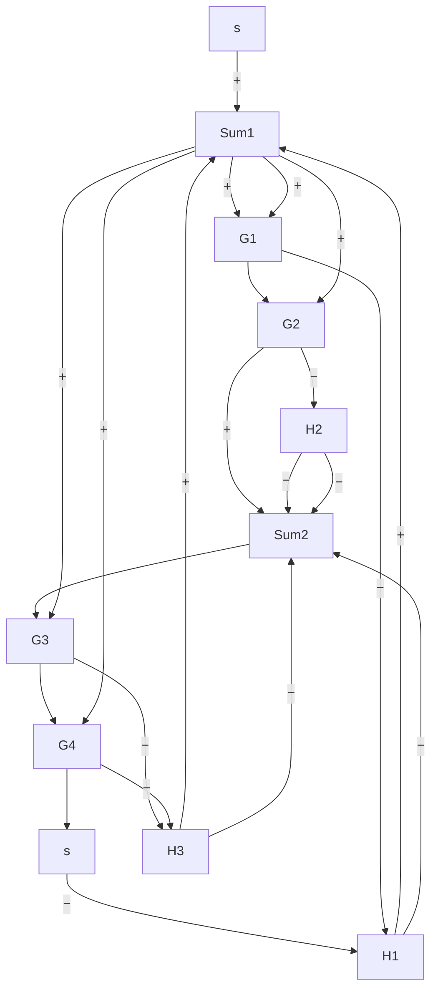
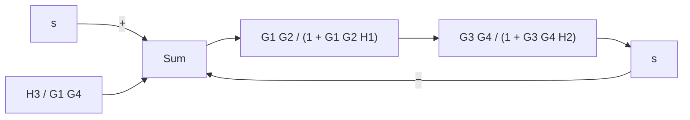
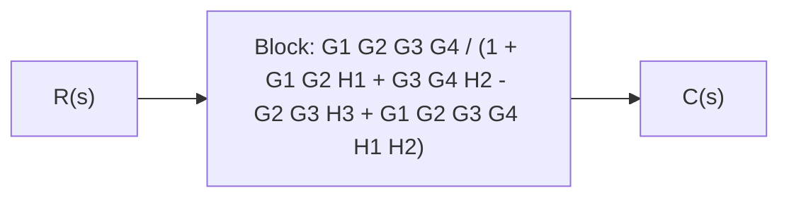

flowchart

Figure 2–21 Block diagram of a system.

flowchart

flowchart

Figure 2–22 Successive reductions of the block diagram shown in Figure 2–21.

flowchart

Solution. First move the branch point between $G _ { 3 }$ and $G _ { 4 }$ to the right-hand side of the loop containing $G _ { 3 } , G _ { 4 }$ , and $H _ { 2 }$ . Then move the summing point between $G _ { 1 }$ and $G _ { 2 }$ to the left-hand side of the first summing point. See Figure 2–22(a). By simplifying each loop, the block diagram can be modified as shown in Figure 2–22(b). Further simplification results in Figure 2–22(c), from which the closed-loop transfer function $C ( s ) / R ( s )$ is obtained as

$$\frac {C (s)}{R (s)} = \frac {G _ {1} G _ {2} G _ {3} G _ {4}}{1 + G _ {1} G _ {2} H _ {1} + G _ {3} G _ {4} H _ {2} - G _ {2} G _ {3} H _ {3} + G _ {1} G _ {2} G _ {3} G _ {4} H _ {1} H _ {2}}$$

A–2–4. Obtain transfer functions $C ( s ) / R ( s )$ and $C ( s ) / D ( s )$ of the system shown in Figure 2–23.

Solution. From Figure 2–23 we have
