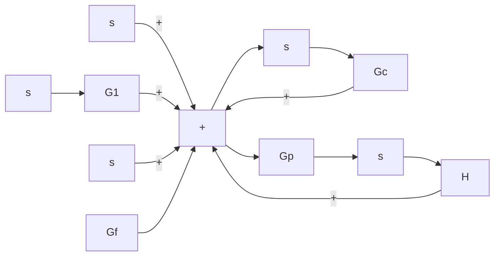
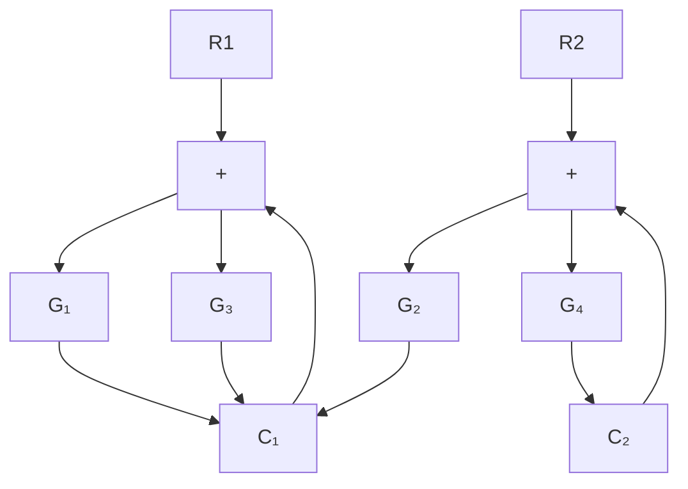

$$U (s) = G _ {f} R (s) + G _ {c} E (s) \tag {2-47}C (s) = G _ {p} \left[ D (s) + G _ {1} U (s) \right] \tag {2-48}E (s) = R (s) - H C (s) \tag {2-49}$$

flowchart

Figure 2–23 Control system with reference input and disturbance input.

By substituting Equation (2–47) into Equation (2–48), we get

$$C (s) = G _ {p} D (s) + G _ {1} G _ {p} \left[ G _ {f} R (s) + G _ {c} E (s) \right] \tag {2-50}$$

By substituting Equation (2–49) into Equation (2–50), we obtain

$$C (s) = G _ {p} D (s) + G _ {1} G _ {p} \left\{G _ {f} R (s) + G _ {c} [ R (s) - H C (s) ] \right\}$$

Solving this last equation for C(s), we get

$$C (s) + G _ {1} G _ {p} G _ {c} H C (s) = G _ {p} D (s) + G _ {1} G _ {p} \left(G _ {f} + G _ {c}\right) R (s)$$

Hence

$$C (s) = \frac {G _ {p} D (s) + G _ {1} G _ {p} \left(G _ {f} + G _ {c}\right) R (s)}{1 + G _ {1} G _ {p} G _ {c} H} \tag {2-51}$$

Note that Equation (2–51) gives the response $C ( s )$ when both reference input $R ( s )$ and disturbance input $D ( s )$ are present.

To find transfer function $C ( s ) / R ( s )$ , we let $D ( s ) = 0$ in Equation (2–51). Then we obtain

$$\frac {C (s)}{R (s)} = \frac {G _ {1} G _ {p} \left(G _ {f} + G _ {c}\right)}{1 + G _ {1} G _ {p} G _ {c} H}$$

Similarly, to obtain transfer function $C ( s ) / D ( s )$ , we let $R ( s ) = 0$ in Equation (2–51). Then $C ( s ) / D ( s )$ can be given by

$$\frac {C (s)}{D (s)} = \frac {G _ {p}}{1 + G _ {1} G _ {p} G _ {c} H}$$

A–2–5. Figure 2–24 shows a system with two inputs and two outputs. Derive $C _ { 1 } ( s ) / R _ { 1 } ( s ) , C _ { 1 } ( s ) / R _ { 2 } ( s )$ , $C _ { 2 } ( s ) / R _ { 1 } ( s )$ , and $C _ { 2 } ( s ) / R _ { 2 } ( s )$ . (In deriving outputs for $R _ { 1 } ( s )$ , assume that $R _ { 2 } ( s )$ is zero, and vice versa.)

flowchart

Figure 2–24   
System with two inputs and two outputs.

Solution. From the figure, we obtain

$$C _ {1} = G _ {1} \left(R _ {1} - G _ {3} C _ {2}\right) \tag {2-52}C _ {2} = G _ {4} \left(R _ {2} - G _ {2} C _ {1}\right) \tag {2-53}$$
