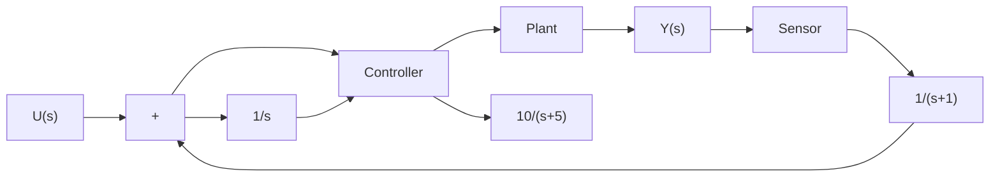

Solution. The system involves one integrator and two delayed integrators. The output of each integrator or delayed integrator can be a state variable. Let us define the output of the plant as $x _ { 1 }$ , the output of the controller as $x _ { 2 } .$ , and the output of the sensor as $x _ { 3 } .$ . Then we obtain

$$\frac {X _ {1} (s)}{X _ {2} (s)} = \frac {1 0}{s + 5}\frac {X _ {2} (s)}{U (s) - X _ {3} (s)} = \frac {1}{s}\frac {X _ {3} (s)}{X _ {1} (s)} = \frac {1}{s + 1}Y (s) = X _ {1} (s)$$

flowchart

Figure 2–26   
Control system.

which can be rewritten as

$$s X _ {1} (s) = - 5 X _ {1} (s) + 1 0 X _ {2} (s)s X _ {2} (s) = - X _ {3} (s) + U (s)s X _ {3} (s) = X _ {1} (s) - X _ {3} (s)Y (s) = X _ {1} (s)$$

By taking the inverse Laplace transforms of the preceding four equations, we obtain

$$\dot {x} _ {1} = - 5 x _ {1} + 1 0 x _ {2}\dot {x} _ {2} = - x _ {3} + u\dot {x} _ {3} = x _ {1} - x _ {3}y = x _ {1}$$

Thus, a state-space model of the system in the standard form is given by

$$
\left[ \begin{array}{c} \dot {x} _ {1} \\ \dot {x} _ {2} \\ \dot {x} _ {3} \end{array} \right] = \left[ \begin{array}{c c c} - 5 & 1 0 & 0 \\ 0 & 0 & - 1 \\ 1 & 0 & - 1 \end{array} \right] \left[ \begin{array}{c} x _ {1} \\ x _ {2} \\ x _ {3} \end{array} \right] + \left[ \begin{array}{c} 0 \\ 1 \\ 0 \end{array} \right] u

y = \left[ \begin{array}{c c c} 1 & 0 & 0 \end{array} \right] \left[ \begin{array}{c} x _ {1} \\ x _ {2} \\ x _ {3} \end{array} \right]
$$

It is important to note that this is not the only state-space representation of the system. Infinitely many other state-space representations are possible. However, the number of state variables is the same in any state-space representation of the same system. In the present system, the number of state variables is three, regardless of what variables are chosen as state variables.

A–2–9. Obtain a state-space model for the system shown in Figure 2–27(a).

Solution. First, notice that $( a s + b ) / s ^ { 2 }$ involves a derivative term. Such a derivative term may be avoided if we modify $( a s + b ) / s ^ { 2 }$ as

$$\frac {a s + b}{s ^ {2}} = \left(a + \frac {b}{s}\right) \frac {1}{s}$$

Using this modification, the block diagram of Figure 2–27(a) can be modified to that shown in Figure 2–27(b).
