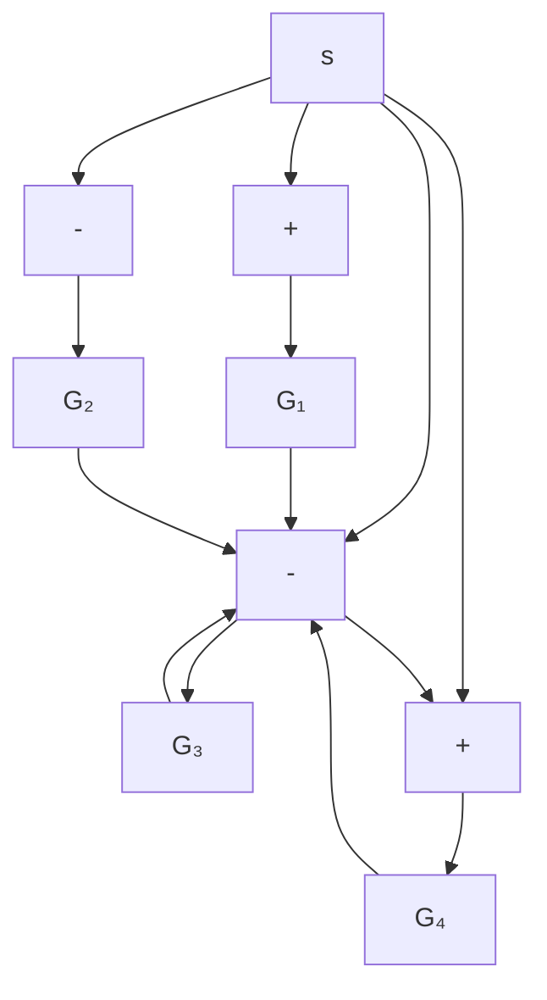
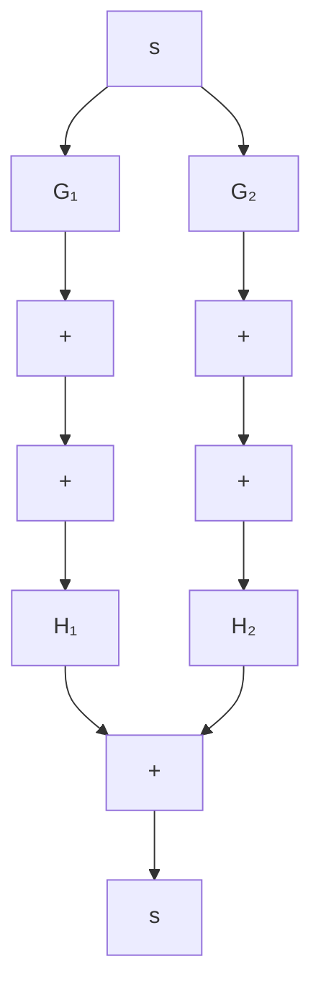
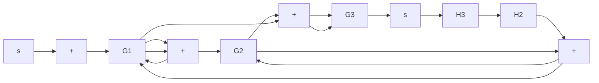

# PROBLEMS

B–2–1. Simplify the block diagram shown in Figure 2–29 and obtain the closed-loop transfer function $C ( s ) / R ( s )$ .

B–2–2. Simplify the block diagram shown in Figure 2–30 and obtain the closed-loop transfer function $C ( s ) / R ( s )$ .

B–2–3. Simplify the block diagram shown in Figure 2–31 and obtain the closed-loop transfer function $C ( s ) / R ( s )$ .

flowchart

Figure 2–29   
Block diagram of a system.

flowchart

Figure 2–30   
Block diagram of a system.

flowchart

Figure 2–31   
Block diagram of a system.

B–2–4. Consider industrial automatic controllers whose control actions are proportional, integral, proportional-plusintegral, proportional-plus-derivative, and proportional-plusintegral-plus-derivative. The transfer functions of these controllers can be given, respectively, by

$$\frac {U (s)}{E (s)} = K _ {p}\frac {U (s)}{E (s)} = \frac {K _ {i}}{s}\frac {U (s)}{E (s)} = K _ {p} \left(1 + \frac {1}{T _ {i} s}\right)\frac {U (s)}{E (s)} = K _ {p} \left(1 + T _ {d} s\right)\frac {U (s)}{E (s)} = K _ {p} \left(1 + \frac {1}{T _ {i} s} + T _ {d} s\right)$$

where $U ( s )$ is the Laplace transform of $u ( t )$ , the controller output, and $E ( s )$ the Laplace transform of $e ( t )$ , the actuating error signal. Sketch $u ( t )$ -versus-t curves for each of the five types of controllers when the actuating error signal is

(a) e(t)=unit-step function   
(b) e(t)=unit-ramp function
