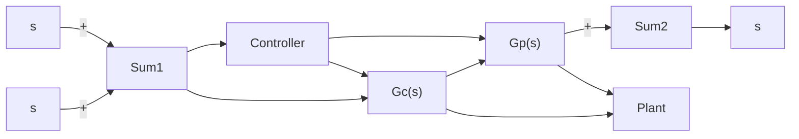
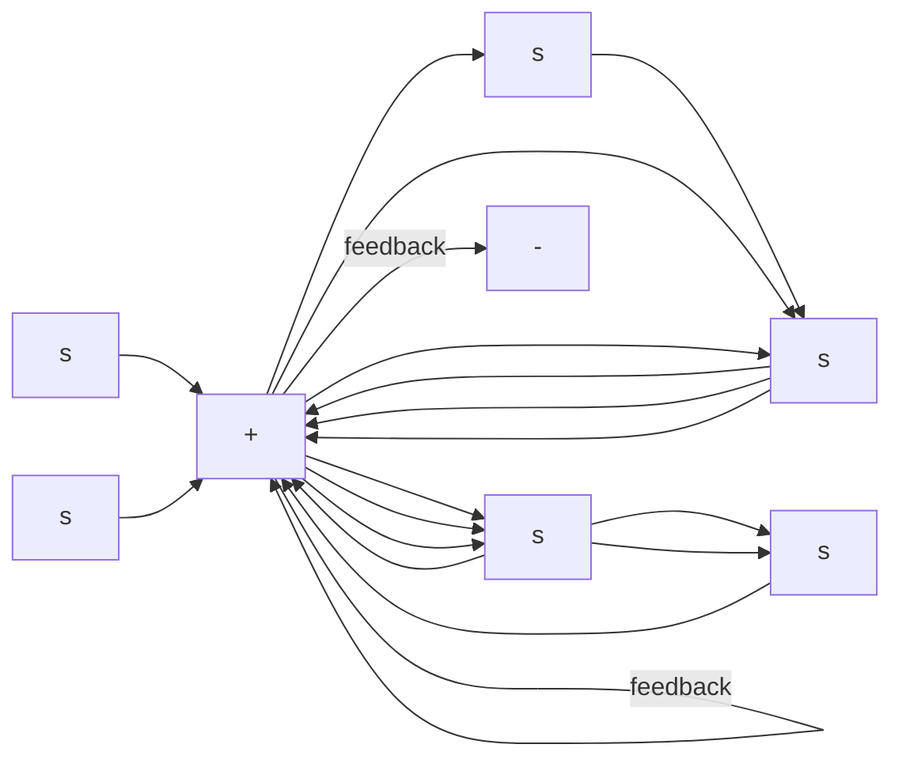
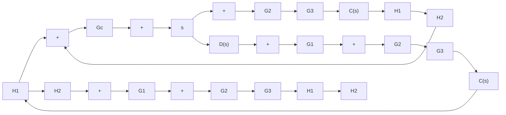

In sketching curves, assume that the numerical values of $K _ { p } ,$ $K _ { i } , T _ { i }$ and, $T _ { d }$ are given as

$$K _ {p} = \text { proportional gain } = 4K _ {i} = \text { integral gain } = 2T _ {i} = \text { integral time } = 2 \secT _ {d} = \text { derivative time } = 0. 8 \sec$$

B–2–5. Figure 2–32 shows a closed-loop system with a reference input and disturbance input. Obtain the expression for the output $C ( s )$ when both the reference input and disturbance input are present.   
B–2–6. Consider the system shown in Figure 2–33. Derive the expression for the steady-state error when both the reference input $R ( s )$ and disturbance input $D ( s )$ are present.   
B–2–7. Obtain the transfer functions $C ( s ) / R ( s )$ and $C ( s ) / D ( s )$ of the system shown in Figure 2–34.

Figure 2–32 Closed-loop system.   

flowchart

Figure 2–33 Control system.   

flowchart

flowchart

Figure 2–34 Control system.

B–2–8. Obtain a state-space representation of the system shown in Figure 2–35.

flowchart

