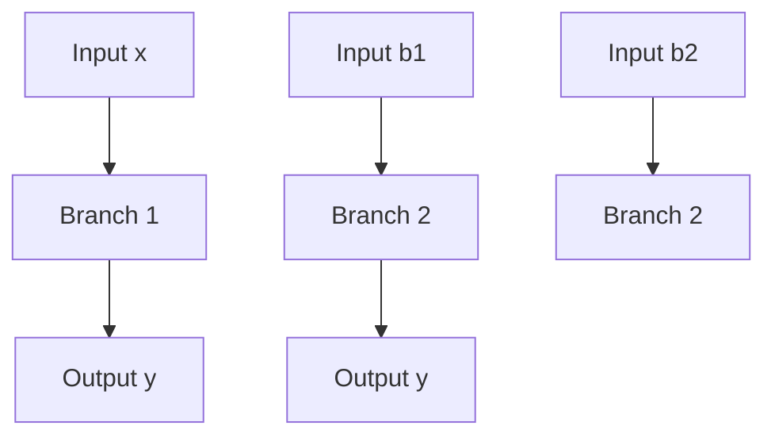
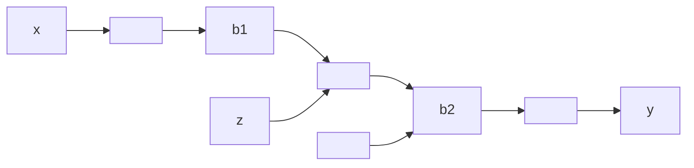

(a)

flowchart

(b)

(a) The force f due to the dampers is

$$f = b _ {1} (\dot {y} - \dot {x}) + b _ {2} (\dot {y} - \dot {x}) = (b _ {1} + b _ {2}) (\dot {y} - \dot {x})$$

In terms of the equivalent viscous-friction coefficient $b _ { \mathrm { e q } }$ , force f is given by

$$f = b _ {\mathrm{eq}} (\dot {y} - \dot {x})$$

Hence

$$b _ {\mathrm{eq}} = b _ {1} + b _ {2}$$

(b) The force f due to the dampers is

$$f = b _ {1} (\dot {z} - \dot {x}) = b _ {2} (\dot {y} - \dot {z}) \tag {3-1}$$

where z is the displacement of a point between damper $b _ { 1 }$ and damper $b _ { 2 } .$ . (Note that the same force is transmitted through the shaft.) From Equation (3–1), we have

$$\left(b _ {1} + b _ {2}\right) \dot {z} = b _ {2} \dot {y} + b _ {1} \dot {x}$$

or

$$\dot {z} = \frac {1}{b _ {1} + b _ {2}} \left(b _ {2} \dot {y} + b _ {1} \dot {x}\right) \tag {3-2}$$

In terms of the equivalent viscous-friction coefficient $b _ { \mathrm { { e q } } } ,$ force f is given by

$$f = b _ {\mathrm{eq}} (\dot {y} - \dot {x})$$

By substituting Equation (3–2) into Equation (3–1), we have

$$
\begin{array}{l} f = b _ {2} (\dot {y} - \dot {z}) = b _ {2} \left[ \dot {y} - \frac {1}{b _ {1} + b _ {2}} \left(b _ {2} \dot {y} + b _ {1} \dot {x}\right) \right] \\ = \frac {b _ {1} b _ {2}}{b _ {1} + b _ {2}} (\dot {y} - \dot {x}) \\ \end{array}
$$

Thus,

$$f = b _ {\mathrm{eq}} (\dot {y} - \dot {x}) = \frac {b _ {1} b _ {2}}{b _ {1} + b _ {2}} (\dot {y} - \dot {x})$$

Hence,

$$b _ {\mathrm{eq}} = \frac {b _ {1} b _ {2}}{b _ {1} + b _ {2}} = \frac {1}{\frac {1}{b _ {1}} + \frac {1}{b _ {2}}}$$
