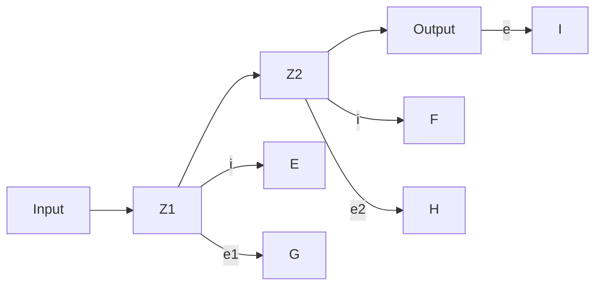

Remember that the impedance approach is valid only if the initial conditions involved are all zeros. Since the transfer function requires zero initial conditions, the impedance approach can be applied to obtain the transfer function of the electrical circuit. This approach greatly simplifies the derivation of transfer functions of electrical circuits.

Consider the circuit shown in Figure 3–9(b). Assume that the voltages $e _ { i }$ and $e _ { o }$ are the input and output of the circuit, respectively. Then the transfer function of this circuit is

$$\frac {E _ {o} (s)}{E _ {i} (s)} = \frac {Z _ {2} (s)}{Z _ {1} (s) + Z _ {2} (s)}$$

For the system shown in Figure 3–7,

$$Z _ {1} = L s + R, \quad Z _ {2} = \frac {1}{C s}$$

Hence the transfer function $E _ { o } ( s ) / E _ { i } ( s )$ can be found as follows:

$$\frac {E _ {o} (s)}{E _ {i} (s)} = \frac {\frac {1}{C s}}{L s + R + \frac {1}{C s}} = \frac {1}{L C s ^ {2} + R C s + 1}$$

which is, of course, identical to Equation (3–26).

flowchart

(a)

text_image

Z₁
eᵢ
Z₂
eₒ

(b)   
Figure 3–9 Electrical circuits.
