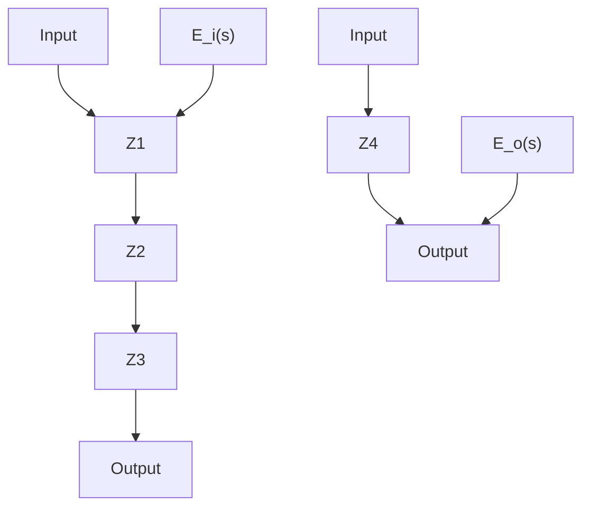
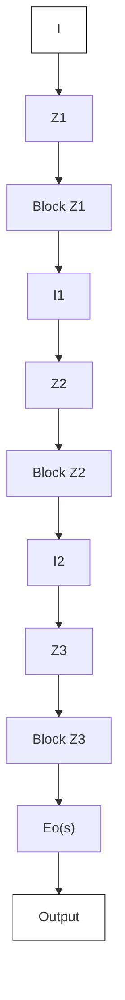

# EXAMPLE 3–7

Consider again the system shown in Figure 3–8. Obtain the transfer function $E _ { o } ( s ) / E _ { i } ( s )$ by use of the complex impedance approach. (Capacitors $C _ { 1 }$ and $C _ { 2 }$ are not charged initially.)

The circuit shown in Figure 3–8 can be redrawn as that shown in Figure 3–10(a), which can be further modified to Figure 3–10(b).

In the system shown in Figure 3–10(b) the current I is divided into two currents $I _ { 1 }$ and $I _ { 2 } .$ . Noting that

$$Z _ {2} I _ {1} = \left(Z _ {3} + Z _ {4}\right) I _ {2}, \quad I _ {1} + I _ {2} = I$$

we obtain

$$I _ {1} = \frac {Z _ {3} + Z _ {4}}{Z _ {2} + Z _ {3} + Z _ {4}} I, \quad I _ {2} = \frac {Z _ {2}}{Z _ {2} + Z _ {3} + Z _ {4}} I$$

Noting that

$$E _ {i} (s) = Z _ {1} I + Z _ {2} I _ {1} = \left[ Z _ {1} + \frac {Z _ {2} \left(Z _ {3} + Z _ {4}\right)}{Z _ {2} + Z _ {3} + Z _ {4}} \right] IE _ {o} (s) = Z _ {4} I _ {2} = \frac {Z _ {2} Z _ {4}}{Z _ {2} + Z _ {3} + Z _ {4}} I$$

we obtain

$$\frac {E _ {o} (s)}{E _ {i} (s)} = \frac {Z _ {2} Z _ {4}}{Z _ {1} \left(Z _ {2} + Z _ {3} + Z _ {4}\right) + Z _ {2} \left(Z _ {3} + Z _ {4}\right)}$$

Substituting $Z _ { 1 } = R _ { 1 } , Z _ { 2 } = 1 / \bigl ( C _ { 1 } s \bigr ) , Z _ { 3 } = R _ { 2 }$ , and $Z _ { 4 } = 1 / \left( C _ { 2 } s \right)$ into this last equation, we get

$$
\begin{array}{l} \frac {E _ {o} (s)}{E _ {i} (s)} = \frac {\frac {1}{C _ {1} s} \frac {1}{C _ {2} s}}{R _ {1} \left(\frac {1}{C _ {1} s} + R _ {2} + \frac {1}{C _ {2} s}\right) + \frac {1}{C _ {1} s} \left(R _ {2} + \frac {1}{C _ {2} s}\right)} \\ = \frac {1}{R _ {1} C _ {1} R _ {2} C _ {2} s ^ {2} + \left(R _ {1} C _ {1} + R _ {2} C _ {2} + R _ {1} C _ {2}\right) s + 1} \\ \end{array}
$$

which is the same as that given by Equation (3–33).

Figure 3–10 (a) The circuit of Figure 3–8 shown in terms of impedances; (b) equivalent circuit diagram.   

flowchart

(a)

flowchart

(b)
