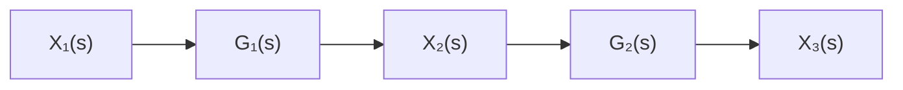
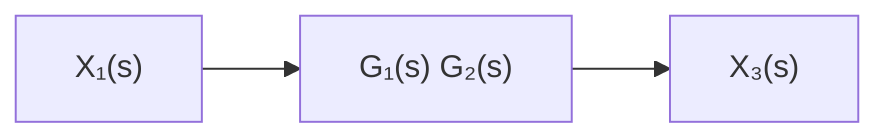

flowchart

(a)

flowchart

(b)   
Figure 3–11   
(a) System consisting of two nonloading cascaded elements; (b) an equivalent system.

Transfer Functions of Nonloading Cascaded Elements. The transfer function of a system consisting of two nonloading cascaded elements can be obtained by eliminating the intermediate input and output. For example, consider the system shown in Figure 3–11(a). The transfer functions of the elements are

$$G _ {1} (s) = \frac {X _ {2} (s)}{X _ {1} (s)} \quad \text { and } \quad G _ {2} (s) = \frac {X _ {3} (s)}{X _ {2} (s)}$$

If the input impedance of the second element is infinite, the output of the first element is not affected by connecting it to the second element.Then the transfer function of the whole system becomes

$$G (s) = \frac {X _ {3} (s)}{X _ {1} (s)} = \frac {X _ {2} (s) X _ {3} (s)}{X _ {1} (s) X _ {2} (s)} = G _ {1} (s) G _ {2} (s)$$

The transfer function of the whole system is thus the product of the transfer functions of the individual elements. This is shown in Figure 3–11(b).

As an example, consider the system shown in Figure 3–12.The insertion of an isolating amplifier between the circuits to obtain nonloading characteristics is frequently used in combining circuits. Since amplifiers have very high input impedances, an isolation amplifier inserted between the two circuits justifies the nonloading assumption.

The two simple RC circuits, isolated by an amplifier as shown in Figure 3–12, have negligible loading effects, and the transfer function of the entire circuit equals the product of the individual transfer functions. Thus, in this case,

$$
\begin{array}{l} \frac {E _ {o} (s)}{E _ {i} (s)} = \left(\frac {1}{R _ {1} C _ {1} s + 1}\right) (K) \left(\frac {1}{R _ {2} C _ {2} s + 1}\right) \\ = \frac {K}{\left(R _ {1} C _ {1} s + 1\right) \left(R _ {2} C _ {2} s + 1\right)} \\ \end{array}
$$
