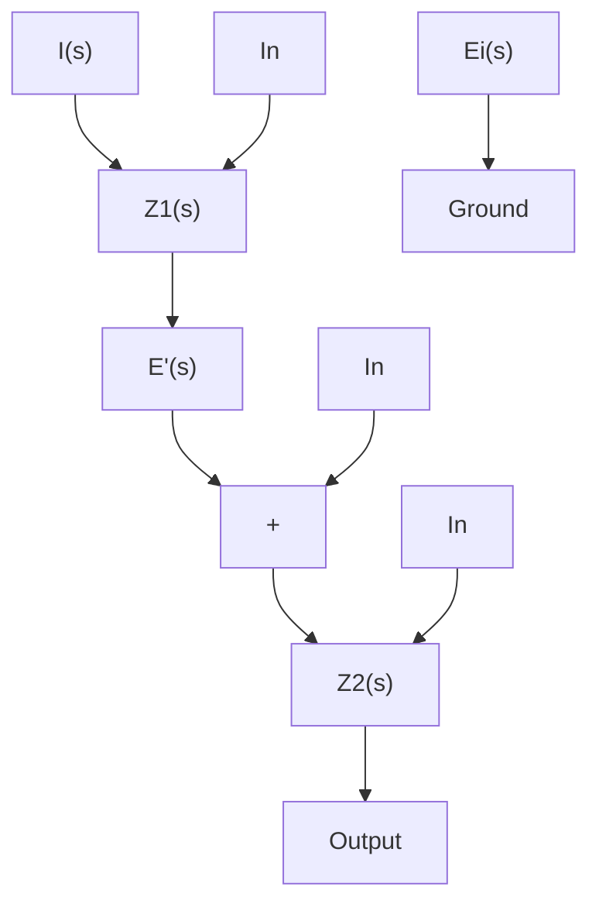

# EXAMPLE 3–8

Figure 3–16 shows an electrical circuit involving an operational amplifier. Obtain the output $e _ { o } .$ Let us define

$$i _ {1} = \frac {e _ {i} - e ^ {\prime}}{R _ {1}}, \quad i _ {2} = C \frac {d (e ^ {\prime} - e _ {o})}{d t}, \quad i _ {3} = \frac {e ^ {\prime} - e _ {o}}{R _ {2}}$$

Noting that the current flowing into the amplifier is negligible, we have

$$i _ {1} = i _ {2} + i _ {3}$$

Hence

$$\frac {e _ {i} - e ^ {\prime}}{R _ {1}} = C \frac {d (e ^ {\prime} - e _ {o})}{d t} + \frac {e ^ {\prime} - e _ {o}}{R _ {2}}$$

Since $e ^ { \prime } \doteq 0 ,$ we have

$$\frac {e _ {i}}{R _ {1}} = - C \frac {d e _ {o}}{d t} - \frac {e _ {o}}{R _ {2}}$$

Taking the Laplace transform of this last equation, assuming the zero initial condition, we have

$$\frac {E _ {i} (s)}{R _ {1}} = - \frac {R _ {2} C s + 1}{R _ {2}} E _ {o} (s)$$

which can be written as

$$\frac {E _ {o} (s)}{E _ {i} (s)} = - \frac {R _ {2}}{R _ {1}} \frac {1}{R _ {2} C s + 1}$$

The op-amp circuit shown in Figure 3–16 is a first-order lag circuit. (Several other circuits involving op amps are shown in Table 3–1 together with their transfer functions. Table 3–1 is given on page 85.)

Figure 3–16 First-order lag circuit using operational amplifier.   

text_image

i1
R1
e'
i2
C
i3
R2
-
+
ei
eo

Figure 3–17 Operationalamplifier circuit.   

flowchart

Impedance Approach to Obtaining Transfer Functions. Consider the op-amp circuit shown in Figure 3–17. Similar to the case of electrical circuits we discussed earlier, the impedance approach can be applied to op-amp circuits to obtain their transfer functions. For the circuit shown in Figure 3–17, we have

$$\frac {E _ {i} (s) - E ^ {\prime} (s)}{Z _ {1}} = \frac {E ^ {\prime} (s) - E _ {o} (s)}{Z _ {2}}$$

Since $E ^ { \prime } ( s ) \doteq 0 ,$ we have,

$$\frac {E _ {o} (s)}{E _ {i} (s)} = - \frac {Z _ {2} (s)}{Z _ {1} (s)} \tag {3-34}$$

EXAMPLE 3–9 Referring to the op-amp circuit shown in Figure 3–16, obtain the transfer function $E _ { o } ( s ) / E _ { i } ( s )$ by use of the impedance approach.
