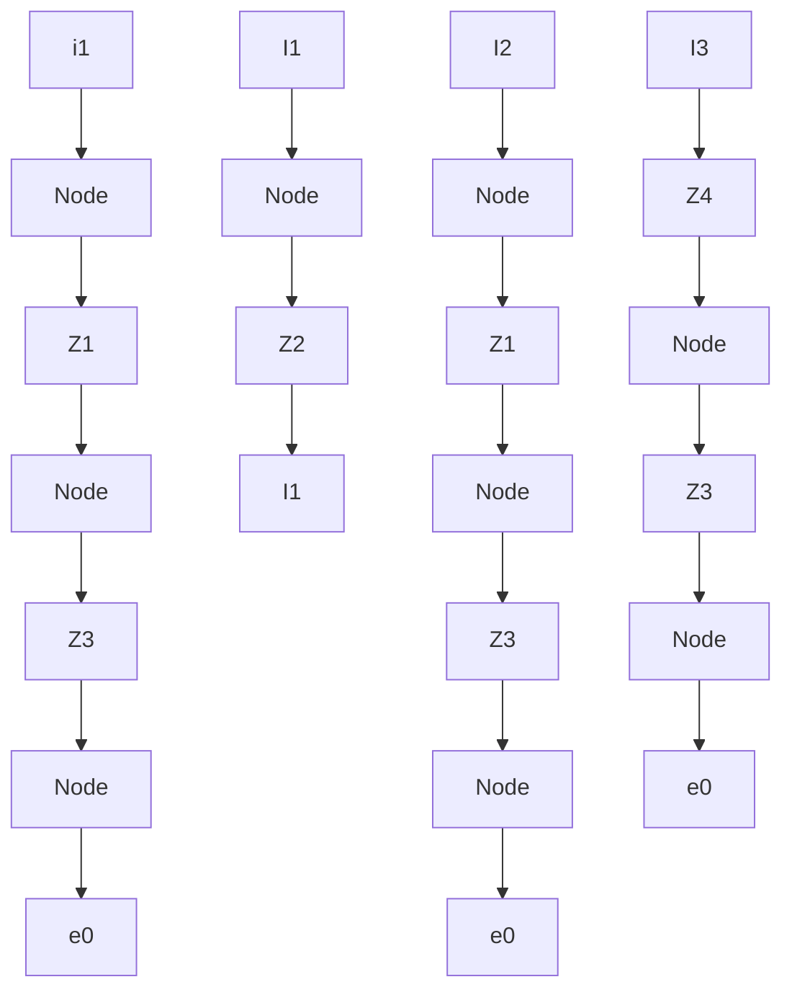

$$\left(b _ {1} s + k _ {1}\right) X _ {i} (s) = \left(b _ {1} s + k _ {1} + b _ {2} s - b _ {2} s \frac {b _ {2} s}{b _ {2} s + k _ {2}}\right) X _ {o} (s)$$

Hence the transfer function $X _ { o } ( s ) / X _ { i } ( s )$ can be obtained as

$$\frac {X _ {o} (s)}{X _ {i} (s)} = \frac {\left(\frac {b _ {1}}{k _ {1}} s + 1\right) \left(\frac {b _ {2}}{k _ {2}} s + 1\right)}{\left(\frac {b _ {1}}{k _ {1}} s + 1\right) \left(\frac {b _ {2}}{k _ {2}} s + 1\right) + \frac {b _ {2}}{k _ {1}} s}$$

For the electrical system shown in Figure 3–23(b), the transfer function $E _ { o } ( s ) / E _ { i } ( s )$ is found to be

$$
\begin{array}{l} \frac {E _ {o} (s)}{E _ {i} (s)} = \frac {R _ {1} + \frac {1}{C _ {1} s}}{\frac {1}{\left(1 / R _ {2}\right) + C _ {2} s} + R _ {1} + \frac {1}{C _ {1} s}} \\ = \frac {\left(R _ {1} C _ {1} s + 1\right) \left(R _ {2} C _ {2} s + 1\right)}{\left(R _ {1} C _ {1} s + 1\right) \left(R _ {2} C _ {2} s + 1\right) + R _ {2} C _ {1} s} \\ \end{array}
$$

A comparison of the transfer functions shows that the systems shown in Figures 3–23(a) and (b) are analogous.

A–3–5. Obtain the transfer functions $E _ { o } ( s ) / E _ { i } ( s )$ of the bridged T networks shown in Figures 3–24(a) and (b).

Solution. The bridged T networks shown can both be represented by the network of Figure 3–25(a), where we used complex impedances.This network may be modified to that shown in Figure 3–25(b).

In Figure 3–25(b), note that

$$I _ {1} = I _ {2} + I _ {3}, \quad I _ {2} Z _ {1} = (Z _ {3} + Z _ {4}) I _ {3}$$

chemical

Electrical circuit diagram with resistors and capacitors labeled R, C1, C2, ei, eo

(a)

chemical

Electrical circuit diagram with resistors R1 and R2, capacitors C, and input/output terminals ei and eo

(b)

flowchart

(a)
