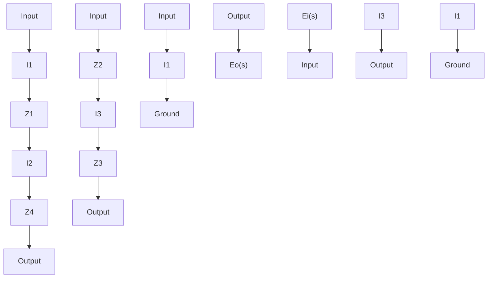

flowchart

Figure 3–24 Bridged T networks.   
Figure 3–25 (a) Bridged T network in terms of complex impedances; (b) equivalent network.

Hence

$$I _ {2} = \frac {Z _ {3} + Z _ {4}}{Z _ {1} + Z _ {3} + Z _ {4}} I _ {1}, \quad I _ {3} = \frac {Z _ {1}}{Z _ {1} + Z _ {3} + Z _ {4}} I _ {1}$$

Then the voltages $E _ { i } ( s )$ and $E _ { o } ( s )$ can be obtained as

$$
\begin{array}{l} E _ {i} (s) = Z _ {1} I _ {2} + Z _ {2} I _ {1} \\ = \left[ Z _ {2} + \frac {Z _ {1} \left(Z _ {3} + Z _ {4}\right)}{Z _ {1} + Z _ {3} + Z _ {4}} \right] I _ {1} \\ = \frac {Z _ {2} \left(Z _ {1} + Z _ {3} + Z _ {4}\right) + Z _ {1} \left(Z _ {3} + Z _ {4}\right)}{Z _ {1} + Z _ {3} + Z _ {4}} I _ {1} \\ \end{array}

\begin{array}{l} E _ {o} (s) = Z _ {3} I _ {3} + Z _ {2} I _ {1} \\ = \frac {Z _ {3} Z _ {1}}{Z _ {1} + Z _ {3} + Z _ {4}} I _ {1} + Z _ {2} I _ {1} \\ = \frac {Z _ {3} Z _ {1} + Z _ {2} \left(Z _ {1} + Z _ {3} + Z _ {4}\right)}{Z _ {1} + Z _ {3} + Z _ {4}} I _ {1} \\ \end{array}
$$

Hence, the transfer function $E _ { o } ( s ) / E _ { i } ( s )$ of the network shown in Figure 3–25(a) is obtained as

$$\frac {E _ {o} (s)}{E _ {i} (s)} = \frac {Z _ {3} Z _ {1} + Z _ {2} \left(Z _ {1} + Z _ {3} + Z _ {4}\right)}{Z _ {2} \left(Z _ {1} + Z _ {3} + Z _ {4}\right) + Z _ {1} Z _ {3} + Z _ {1} Z _ {4}} \tag {3-38}$$

For the bridged T network shown in Figure 3–24(a), substitute

$$Z _ {1} = R, \quad Z _ {2} = \frac {1}{C _ {1} s}, \quad Z _ {3} = R, \quad Z _ {4} = \frac {1}{C _ {2} s}$$

into Equation (3–38). Then we obtain the transfer function $E _ { o } ( s ) / E _ { i } ( s )$ to be

$$
\begin{array}{l} \frac {E _ {o} (s)}{E _ {i} (s)} = \frac {R ^ {2} + \frac {1}{C _ {1} s} \left(R + R + \frac {1}{C _ {2} s}\right)}{\frac {1}{C _ {1} s} \left(R + R + \frac {1}{C _ {2} s}\right) + R ^ {2} + R \frac {1}{C _ {2} s}} \\ = \frac {R C _ {1} R C _ {2} s ^ {2} + 2 R C _ {2} s + 1}{R C _ {1} R C _ {2} s ^ {2} + (2 R C _ {2} + R C _ {1}) s + 1} \\ \end{array}
$$

Similarly, for the bridged T network shown in Figure 3–24(b), we substitute

$$Z _ {1} = \frac {1}{C s}, \quad Z _ {2} = R _ {1}, \quad Z _ {3} = \frac {1}{C s}, \quad Z _ {4} = R _ {2}$$

into Equation (3–38). Then the transfer function $E _ { o } ( s ) / E _ { i } ( s )$ can be obtained as follows:
