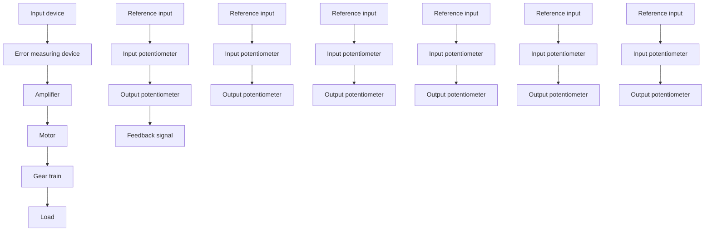
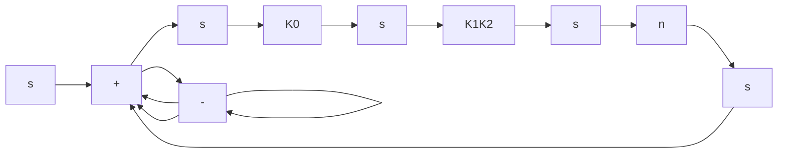
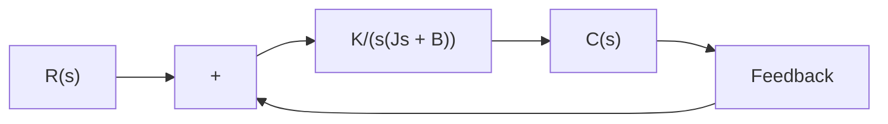

flowchart

(a)

flowchart

flowchart

Figure 3–29 (a) Schematic diagram of servo system; (b) block diagram for the system; (c) simplified block diagram.

Obtain the transfer function between the motor shaft angular displacement u and the error voltage $e _ { v } .$ . Obtain also a block diagram for this system and a simplified block diagram when $L _ { a }$ is negligible.

Solution. The speed of an armature-controlled dc servomotor is controlled by the armature voltage $\boldsymbol { e } _ { a } .$ . (The armature voltage $e _ { a } = K _ { 1 } e _ { v }$ is the output of the amplifier.) The differential equation for the armature circuit is

$$L _ {a} \frac {d i _ {a}}{d t} + R _ {a} i _ {a} + e _ {b} = e _ {a}$$

or

$$L _ {a} \frac {d i _ {a}}{d t} + R _ {a} i _ {a} + K _ {3} \frac {d \theta}{d t} = K _ {1} e _ {v} \tag {3-46}$$

The equation for torque equilibrium is

$$J _ {0} \frac {d ^ {2} \theta}{d t ^ {2}} + b _ {0} \frac {d \theta}{d t} = T = K _ {2} i _ {a} \tag {3-47}$$
