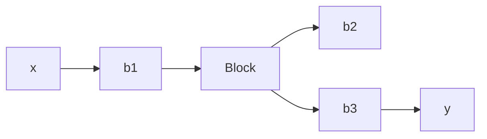

# PROBLEMS

B–3–1. Obtain the equivalent viscous-friction coefficient $b _ { e q }$ of the system shown in Figure 3–30.   
B–3–2. Obtain mathematical models of the mechanical systems shown in Figures 3–31(a) and (b).   

flowchart

Figure 3–30 Damper system.

text_image

x (Output)
k
m
u(t)
(Input force)
No friction

text_image

k₁ k₂ m
x (Output)
u(t) (Input force)
No friction

(b)   
Figure 3–31 Mechanical systems.

B–3–3. Obtain a state-space representation of the mechanical system shown in Figure 3–32, where $u _ { 1 }$ and $u _ { 2 }$ are the inputs and $y _ { 1 }$ and $y _ { 2 }$ are the outputs.

text_image

k₁
u₁
m₁
y₁
b₁
u₂
m₂
y₂
k₂

Figure 3–32 Mechanical system.

B–3–4. Consider the spring-loaded pendulum system shown in Figure 3–33. Assume that the spring force acting on the pendulum is zero when the pendulum is vertical, or $\theta = 0 .$ Assume also that the friction involved is negligible and the angle of oscillation u is small. Obtain a mathematical model of the system.

text_image

θ
k
k
a
ℓ
mg

Figure 3–33 Spring-loaded pendulum system.

B–3–5. Referring to Examples 3–5 and 3–6, consider the inverted-pendulum system shown in Figure 3–34. Assume that the mass of the inverted pendulum is m and is evenly distributed along the length of the rod. (The center of gravity of the pendulum is located at the center of the rod.) Assuming that u is small, derive mathematical models for the system in the forms of differential equations, transfer functions, and state-space equations.

text_image

y
x
θ
G
ℓ
x′
y′
O
x
u
M

