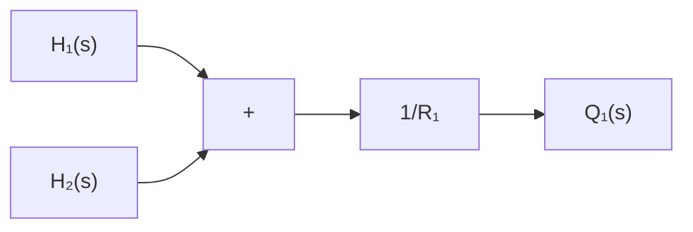

If, however, $q _ { o }$ is taken as the output, the input being the same, then the transfer function is

$$\frac {Q _ {o} (s)}{Q _ {i} (s)} = \frac {1}{R C s + 1}$$

where we have used the relationship

$$Q _ {o} (s) = \frac {1}{R} H (s)$$

Liquid-Level Systems with Interaction. Consider the system shown in Figure 4–2. In this system, the two tanks interact. Thus the transfer function of the system is not the product of two first-order transfer functions.

In the following, we shall assume only small variations of the variables from the steady-state values. Using the symbols as defined in Figure 4–2, we can obtain the following equations for this system:

$$\frac {h _ {1} - h _ {2}}{R _ {1}} = q _ {1} \tag {4-3}C _ {1} \frac {d h _ {1}}{d t} = q - q _ {1} \tag {4-4}\frac {h _ {2}}{R _ {2}} = q _ {2} \tag {4-5}C _ {2} \frac {d h _ {2}}{d t} = q _ {1} - q _ {2} \tag {4-6}$$

If q is considered the input and $q _ { 2 }$ the output, the transfer function of the system is

$$\frac {Q _ {2} (s)}{Q (s)} = \frac {1}{R _ {1} C _ {1} R _ {2} C _ {2} s ^ {2} + \left(R _ {1} C _ {1} + R _ {2} C _ {2} + R _ {2} C _ {1}\right) s + 1} \tag {4-7}$$

text_image

Q̅ + q
Tank 1
Tank 2
H̅₁ + h₁
R₁
H̅₂ + h₂
C₁
Q̅ + q₁
C₂
R₂
Q̅ + q₂

Figure 4–2 Liquid-level system with interaction.

Q : Steady-state flow rate

H : Steady-state liquid level of tank 1

H2 : Steady-state liquid level of tank 2

It is instructive to obtain Equation (4–7), the transfer function of the interacted system, by block diagram reduction. From Equations (4–3) through (4–6), we obtain the elements of the block diagram, as shown in Figure 4–3(a). By connecting signals properly, we can construct a block diagram, as shown in Figure 4–3(b). This block diagram can be simplified, as shown in Figure 4–3(c). Further simplifications result in Figures 4–3(d) and (e). Figure 4–3(e) is equivalent to Equation (4–7).

flowchart

flowchart

