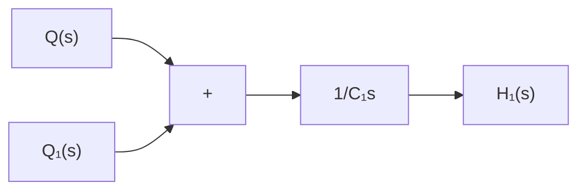
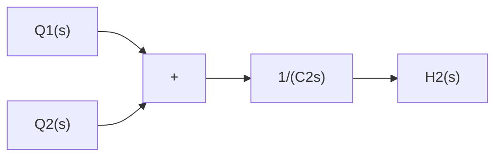
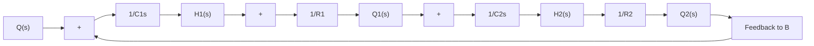

```mermaid
graph LR
    A["Q(s)"] --> B["+"]
    C["Q₁(s)"] --> B
    B --> D["1/C₁s"]
    D --> E["H₁(s)"]
```

flowchart

```mermaid
graph LR
    A["Q1(s)"] --> B["+"]
    C["Q2(s)"] --> B
    B --> D["1/(C2s)"]
    D --> E["H2(s)"]
```

flowchart

```mermaid
graph LR
    A["Q(s)"] --> B["+"]
    B --> C["1/C1s"]
    C --> D["H1(s)"]
    D --> E["+"]
    E --> F["1/R1"]
    F --> G["Q1(s)"]
    G --> H["+"]
    H --> I["1/C2s"]
    I --> J["H2(s)"]
    J --> K["1/R2"]
    K --> L["Q2(s)"]
    L --> M["Feedback to B"]
    M --> B
```

(b)

flowchart

