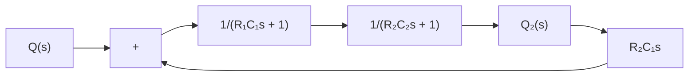
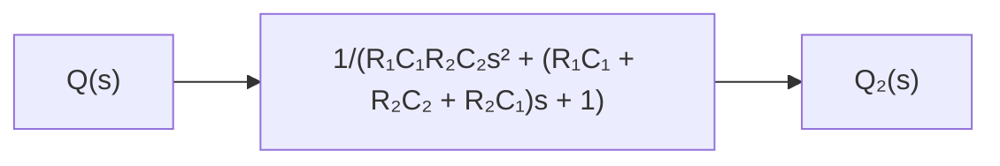

```mermaid
graph LR
    A["Q(s)"] --> B["+"]
    B --> C["1/C1s"]
    C --> D["1/R1"]
    D --> E["+"]
    E --> F["1/C2s"]
    F --> G["1/R2"]
    G --> H["Q2(s)"]
    H --> I["R2C1s"]
    I --> B
    J["Q1(s)"] --> E
    K["+"] --> L["-"]
    M["+"] --> N["+"] --> O["+"] --> P["+"] --> Q["+"] --> R["+"] --> S["+"] --> T["+"] --> U["+"] --> V["+"] --> W["+"] --> X["+"] --> Y["+"] --> Z["+"] --> AA["+"] --> AB["+"] --> AC["+"] --> AD["+"] --> AE["+"] --> AF["+"] --> AG["+"] --> AH["+"] --> AI["+"] --> AJ["+"] --> AK["+"] --> AL["+"] --> AM["+"] --> AN["+"] --> AO["+"] --> AP["+"] --> AQ["+"] --> AR["+"] --> AS["+"] --> AT["+"] --> AU["+"] --> AV["+"] --> AW["+"] --> AX["+"] --> AY["+"] --> AZ["+"] --> BA["+"] --> BB["+"] --> BC["+"] --> BD["+"] --> BE["+"] --> BF["+"] --> BG["+"] --> BH["+"] --> BI["+"] --> BJ["+"] --> BK["+"] --> BL["+"] --> BM["+"] --> BN["+"] --> BO["+"] --> BP["+"] --> BQ["+"] --> BR["+"] --> BS["+"] --> BT["+"] --> BU["+"] --> BV["+"] --> BW["+"] --> BX["+"] --> BY["+"] --> BZ["+"] --> CA["+"] --> CB["+"] --> CC["+"] --> CD["+"] --> CE["+"] --> CF["+"] --> CG["+"] --> CH["+"] --> CI["+"] --> CJ["+"] --> CK["+"] --> CR["+"] --> CS["+"] --> CT["+"] --> CU["+"] --> CV["+"] --> DW["+"] --> DX["+"] --> DXB["+"] --> DXF["+"] --> DXG["+"] --> DXH["+"] --> DXI["+"] --> DXJ["+"] --> DXK["+"] --> DXL["+"] --> DXM["+"] --> DXN["+"] --> DXO["+"] --> DXP["+"] --> DXQ
    style A fill:#f9f,stroke:#333
    style H fill:#f9f,stroke:#333
    style Z fill:#f9f,stroke:#333
    style BC fill:#f9f,stroke:#333
    style RX fill:#f9f,stroke:#333
    style Y fill:#f9f,stroke:#333
    style SX fill:#f9f,stroke:#333
    style YO fill:#f9f,stroke:#333
```

flowchart

(d)

flowchart

Figure 4–3   
(a) Elements of the block diagram of the system shown in Figure 4–2; (b) block diagram of the system; (c)–(e) successive reductions of the block diagram.

Notice the similarity and difference between the transfer function given by Equation (4–7) and that given by Equation (3–33). The term $R _ { 2 } C _ { 1 } s$ that appears in the denominator of Equation (4–7) exemplifies the interaction between the two tanks. Similarly, the term $R _ { 1 } C _ { 2 } s$ in the denominator of Equation (3–33) represents the interaction between the two RC circuits shown in Figure 3–8.
