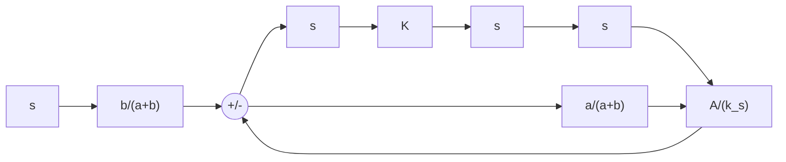

b/a+b e
e
a
b
-
a
b
y
a/a+b y
=
e
x
y

flowchart

  
(f)   
Figure 4–8

(b) flapper mounted on a fixed point; (c) flapper mounted on a feedback bellows;

(d) displacement x as a result of addition of two small displacements;

(e) block diagram for the controller; (f) simplified block diagram for the controller.

displacement of bellows equal to $\overbar { Y } .$ the displacement of the diaphragm equal to, ${ \bar { Z } } .$ the, nozzle back pressure equal to $\overline { { P } } _ { b }$ and the control pressure equal to, $\hat { P } _ { c }$ When an actuating. error exists, the nozzle–flapper distance, the displacement of the bellows, the displacement of the diaphragm, the nozzle back pressure, and the control pressure deviate from their respective equilibrium values.Let these deviations be $x , y , z , p _ { b }$ ,and $p _ { c }$ , respectively. (The positive direction for each displacement variable is indicated by an arrowhead in the diagram.)

Assuming that the relationship between the variation in the nozzle back pressure and the variation in the nozzle–flapper distance is linear, we have

$$p _ {b} = K _ {1} x \tag {4-13}$$

where $K _ { 1 }$ is a positive constant. For the diaphragm valve,

$$p _ {b} = K _ {2} z \tag {4-14}$$

where $K _ { 2 }$ is a positive constant. The position of the diaphragm valve determines the control pressure. If the diaphragm valve is such that the relationship between $p _ { c }$ and z is linear, then

$$p _ {c} = K _ {3} z \tag {4-15}$$

where $K _ { 3 }$ is a positive constant. From Equations (4–13), (4–14), and (4–15), we obtain

$$p _ {c} = \frac {K _ {3}}{K _ {2}} p _ {b} = \frac {K _ {1} K _ {3}}{K _ {2}} x = K x \tag {4-16}$$

where $K = K _ { 1 } K _ { 3 } / K _ { 2 }$ is a positive constant. For the flapper, since there are two small movements (e and y) in opposite directions, we can consider such movements separately and add up the results of two movements into one displacement x. See Figure 4–8(d). Thus, for the flapper movement, we have

$$x = \frac {b}{a + b} e - \frac {a}{a + b} y \tag {4-17}$$
