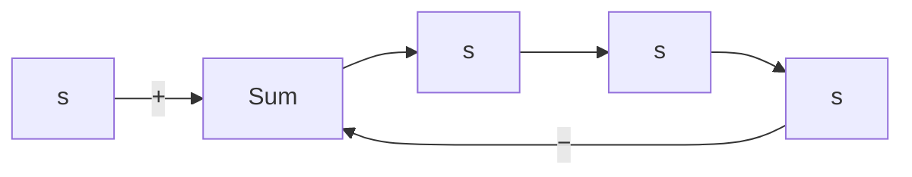

where $X ( s ) = { \mathcal { L } } [ x ]$ and $P _ { c } ( s ) = \mathcal { L } [ p _ { c } ]$ If. $q _ { i }$ , the change in flow through the pneumatic actuating valve, is proportional to x, the change in the valve-stem displacement, then

$$\frac {Q _ {i} (s)}{X (s)} = K _ {q}$$

where $Q _ { i } ( s ) = \mathcal { L } [ q _ { i } ]$ and $K _ { q }$ is a constant. The transfer function between $q _ { i }$ and $p _ { c }$ becomes

$$\frac {Q _ {i} (s)}{P _ {c} (s)} = K _ {c} K _ {q} = K _ {v}$$

where $K _ { v }$ is a constant.

The standard control pressure for this kind of a pneumatic actuating valve is between 3 and 15 psig. The valve-stem displacement is limited by the allowable stroke of the diaphragm and is only a few inches. If a longer stroke is needed, a piston–spring combination may be employed.

In pneumatic actuating valves, the static-friction force must be limited to a low value so that excessive hysteresis does not result. Because of the compressibility of air, the control action may not be positive; that is, an error may exist in the valve-stem position. The use of a valve positioner results in improvements in the performance of a pneumatic actuating valve.

Basic Principle for Obtaining Derivative Control Action. We shall now present methods for obtaining derivative control action. We shall again place the emphasis on the principle and not on the details of the actual mechanisms.

The basic principle for generating a desired control action is to insert the inverse of the desired transfer function in the feedback path. For the system shown in Figure 4–12, the closed-loop transfer function is

$$\frac {C (s)}{R (s)} = \frac {G (s)}{1 + G (s) H (s)}$$

If $\vert G ( s ) H ( s ) \vert \gg 1$ , then $C ( s ) / R ( s )$ can be modified to

$$\frac {C (s)}{R (s)} = \frac {1}{H (s)}$$

Thus, if proportional-plus-derivative control action is desired, we insert an element having the transfer function $1 / ( T s + 1 )$ in the feedback path.

flowchart

Figure 4–12 Control system.

text_image

P_s
\bar{X} + x
e
a
b
\bar{P}_c + p_c

(a)

