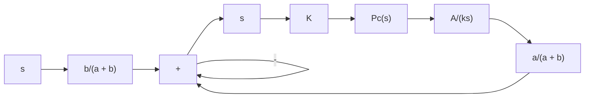
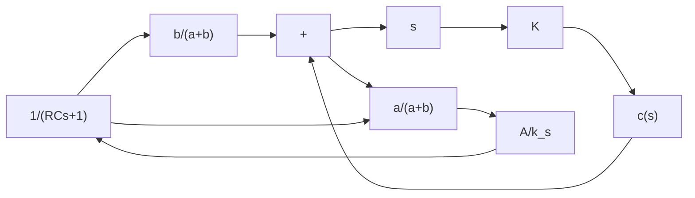

flowchart

(b)   
Figure 4–13   
(a) Pneumatic proportional controller; (b) block diagram of the controller.

Consider the pneumatic controller shown in Figure 4–13(a). Considering small changes in the variables, we can draw a block diagram of this controller as shown in Figure 4–13(b). From the block diagram we see that the controller is of proportional type.

We shall now show that the addition of a restriction in the negative feedback path will modify the proportional controller to a proportional-plus-derivative controller, or a PD controller.

Consider the pneumatic controller shown in Figure 4–14(a).Assuming again small changes in the actuating error, nozzle–flapper distance, and control pressure, we can summarize the operation of this controller as follows: Let us first assume a small step change in e.

text_image

P_s
\bar{X} + x
e
a
b
R
C
\bar{P}_c + p_c

(a)

text_image

e
x
pc
t

(b)   
Figure 4–14   
(a) Pneumatic proportional-plusderivative controller; (b) step change in e and the corresponding changes in x and $p _ { c }$ plotted versus t; (c) block diagram of the controller.

flowchart

(c)
