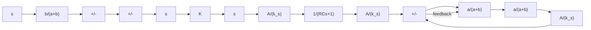
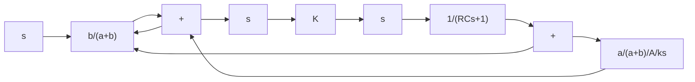

Consider the pneumatic controller shown in Figure 4–15(a).The operation of this controller is as follows: The bellows denoted by I is connected to the control pressure source without any restriction. The bellows denoted by II is connected to the control pressure source through a restriction. Let us assume a small step change in the actuating error.This will cause the back pressure in the nozzle to change instantaneously.Thus a change in the control pressure $p _ { c }$ also occurs instantaneously. Due to the restriction of the valve in the path to bellows II, there will be a pressure drop across the valve. As time goes on, air will flow across the valve in such a way that the change in pressure in bellows II attains the value $p _ { c }$ . Thus bellows II will expand or contract as time elapses in such a way as to move the flapper an additional amount in the direction of the original displacement e.This will cause the back pressure $p _ { c }$ in the nozzle to change continuously, as shown in Figure 4–15(b).

text_image

P_s
R
C
I
II
e
X̄ + x
a
b
P̄_c + p_c

(a)

  
(b)

flowchart

(c)

flowchart

(d)

Note that the integral control action in the controller takes the form of slowly canceling the feedback that the proportional control originally provided.
