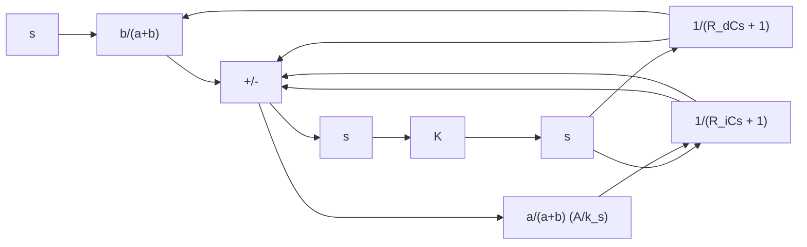

A block diagram of this controller under the assumption of small variations in the variables is shown in Figure 4–15(c). A simplification of this block diagram yields Figure 4–15(d). The transfer function of this controller is

$$\frac {P _ {c} (s)}{E (s)} = \frac {\frac {b}{a + b} K}{1 + \frac {K a}{a + b} \frac {A}{k _ {s}} \left(1 - \frac {1}{R C s + 1}\right)}$$

Figure 4–15

(a) Pneumatic proportional-plusintegral controller; (b) step change in e and the corresponding changes in x and $p _ { c }$ plotted versus t; (c) block diagram of the controller; (d) simplified block diagram.

where K is a constant, A is the area of the bellows, and $k _ { s }$ is the equivalent spring constant of the combined bellows. If $\left| K a A R C s / [ ( a + b ) k _ { s } ( R C s + 1 ) ] \right| \hat { \gg } 1$ which is usually the, case, the transfer function can be simplified to

$$\frac {P _ {c} (s)}{E (s)} = K _ {p} \left(1 + \frac {1}{T _ {i} s}\right)$$

where

$$K _ {p} = \frac {b k _ {s}}{a A}, \quad T _ {i} = R C$$

Obtaining Pneumatic Proportional-Plus-Integral-Plus-Derivative Control Action. A combination of the pneumatic controllers shown in Figures 4–14(a) and 4–15(a) yields a proportional-plus-integral-plus-derivative controller, or a PID controller. Figure 4–16(a) shows a schematic diagram of such a controller. Figure 4–16(b) shows a block diagram of this controller under the assumption of small variations in the variables.

text_image

Ps →
(Ri >> Rd)
Ri
Rd
C C
P̄c + pc
e ←
X̄ + x ←
a
b

(a)

flowchart

(b)   
Figure 4–16 (a) Pneumatic proportional-plusintegral-plusderivative controller; (b) block diagram of the controller.

The transfer function of this controller is

$$\frac {P _ {c} (s)}{E (s)} = \frac {\frac {b K}{a + b}}{1 + \frac {K a}{a + b} \frac {A}{k _ {s}} \frac {(R _ {i} C - R _ {d} C) s}{(R _ {d} C s + 1) (R _ {i} C s + 1)}}$$

By defining

$$T _ {i} = R _ {i} C, \qquad T _ {d} = R _ {d} C$$
