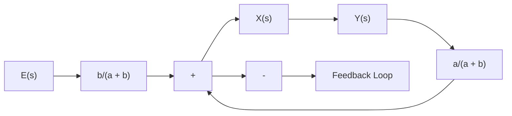

The controller here operates in the following way. If input e moves the pilot valve to the right, port II will be uncovered and high-pressure oil will flow through port II into the right-hand side of the power piston and force this piston to the left. The power piston, in moving to the left, will carry the feedback link ABC with it, thereby moving the pilot valve to the left.This action continues until the pilot piston again covers ports I and II. A block diagram of the system can be drawn as in Figure 4–20(b). The transfer function between $\bar { Y } ( s )$ and $E ( s )$ is given by

$$\frac {Y (s)}{E (s)} = \frac {\frac {b}{a + b} \frac {K}{s}}{1 + \frac {K}{s} \frac {a}{a + b}}$$

Noting that under the normal operating conditions we have $\left| K a / [ s ( a + b ) ] \right| \gg 1$ this, last equation can be simplified to

$$\frac {Y (s)}{E (s)} = \frac {b}{a} = K _ {p}$$

Figure 4–20 (a) Servomotor that acts as a proportional controller; (b) block diagram of the servomotor.   

text_image

e → A
x → B
y ← C
a
b
I
II
Oil under pressure
(a)

flowchart

The transfer function between y and e becomes a constant.Thus, the hydraulic controller shown in Figure 4–20(a) acts as a proportional controller, the gain of which is $K _ { p }$ .This gain can be adjusted by effectively changing the lever ratio $b / a .$ . (The adjusting mechanism is not shown in the diagram.)

We have thus seen that the addition of a feedback link will cause the hydraulic servomotor to act as a proportional controller.

Dashpots. The dashpot (also called a damper) shown in Figure 4–21(a) acts as a differentiating element. Suppose that we introduce a step displacement to the piston position y.Then the displacement z becomes equal to y momentarily. Because of the spring force, however, the oil will flow through the resistance R and the cylinder will come back to the original position. The curves y versus t and z versus t are shown in Figure 4–21(b).
