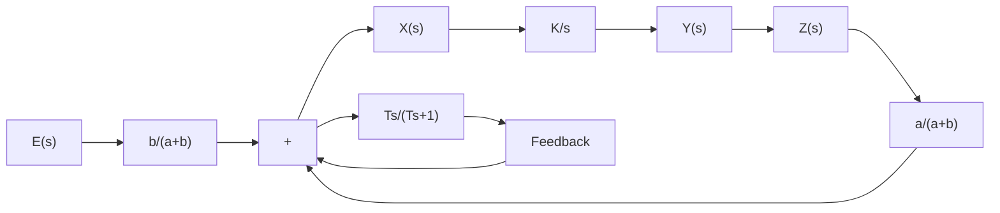

Let us define $R A ^ { 2 } \rho / k = T$ . (Note that $R A ^ { 2 } \rho / k$ has the dimension of time.) Then

$$\frac {Z (s)}{Y (s)} = \frac {T s}{T s + 1} = \frac {1}{1 + \frac {1}{T s}}$$

Clearly, the dashpot is a differentiating element. Figure 4–21(c) shows a block diagram representation for this system.

Obtaining Hydraulic Proportional-Plus-Integral Control Action. Figure 4–22(a) shows a schematic diagram of a hydraulic proportional-plus-integral controller.A block diagram of this controller is shown in Figure 4–22(b). The transfer function $Y ( s ) / E ( s )$ is given by

$$\frac {Y (s)}{E (s)} = \frac {\frac {b}{a + b} \frac {K}{s}}{1 + \frac {K a}{a + b} \frac {T}{T s + 1}}$$

text_image

Oil under pressure
Spring constant = k
a
b
Area = A
Density of oil = ρ
Resistance = R
(a)

flowchart

Figure 4–22 (a) Schematic diagram of a hydraulic proportional-plus-integral controller; (b) block diagram of the controller.

In such a controller, under normal operation $\big | K a T / \big [ ( a + b ) ( T s + 1 ) \big ] \big | \gg 1$ with the, result that

$$\frac {Y (s)}{E (s)} = K _ {p} \bigg (1 + \frac {1}{T _ {i} s} \bigg)$$

where

$$K _ {p} = \frac {b}{a}, \qquad T _ {i} = T = \frac {R A ^ {2} \rho}{k}$$

Thus the controller shown in Figure 4–22(a) is a proportional-plus-integral controller (PI controller).

Obtaining Hydraulic Proportional-Plus-Derivative Control Action. Figure 4–23(a) shows a schematic diagram of a hydraulic proportional-plus-derivative controller. The cylinders are fixed in space and the pistons can move. For this system, notice that

$$k (y - z) = A \left(P _ {2} - P _ {1}\right)q = \frac {P _ {2} - P _ {1}}{R}q d t = \rho A d z$$

Hence

$$y = z + \frac {A}{k} q R = z + \frac {R A ^ {2} \rho}{k} \frac {d z}{d t}$$

or

$$\frac {Z (s)}{Y (s)} = \frac {1}{T s + 1}$$

text_image

e
a
x
b
z
R
P2 P1
q
k
Area = A
y
Density of oil = ρ

(a)
