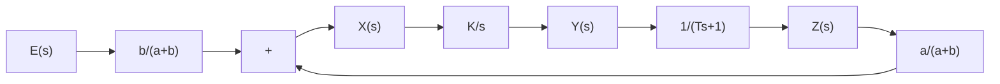
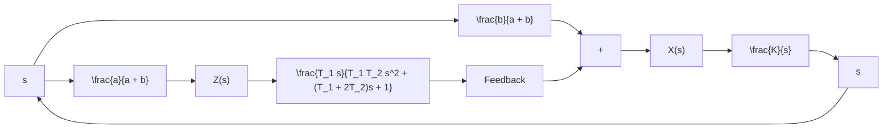

flowchart

(b)   
Figure 4–23 (a) Schematic diagram of a hydraulic proportional-plus-derivative controller; (b) block diagram of the controller.

where

$$T = \frac {R A ^ {2} \rho}{k}$$

A block diagram for this system is shown in Figure 4–23(b). From the block diagram the transfer function $Y ( s ) / E ( s )$ can be obtained as

$$\frac {Y (s)}{E (s)} = \frac {\frac {b}{a + b} \frac {K}{s}}{1 + \frac {a}{a + b} \frac {K}{s} \frac {1}{T s + 1}}$$

Under normal operation we have $\big | a K / \big [ ( a + b ) s ( T s + 1 ) \big ] \big | \gg 1$ Hence.

$$\frac {Y (s)}{E (s)} = K _ {p} (1 + T s)$$

where

$$K _ {p} = \frac {b}{a}, \quad T = \frac {R A ^ {2} \rho}{k}$$

Thus the controller shown in Figure 4–23(a) is a proportional-plus-derivative controller (PD controller).

Obtaining Hydraulic Proportional-Plus-Integral-Plus-Derivative Control Action. Figure 4–24 shows a schematic diagram of a hydraulic proportional-plus-integral-plusderivative controller. It is a combination of the proportional-plus-integral controller and proportional-plus derivative controller.

If the two dashpots are identical except the piston shafts, the transfer function $Z ( s ) / Y ( s )$ can be obtained as follows:

$$\frac {Z (s)}{Y (s)} = \frac {T _ {1} s}{T _ {1} T _ {2} s ^ {2} + \left(T _ {1} + 2 T _ {2}\right) s + 1}$$

(For the derivation of this transfer function, refer to Problem A–4–9.)

Figure 4–24 Schematic diagram of a hydraulic proportional-plusintegral-plusderivative controller.   

text_image

e
a
x
b
R
R
k₁
z
k₂
Area = A
y

Figure 4–25 Block diagram for the system shown in Figure 4–24.   

flowchart

