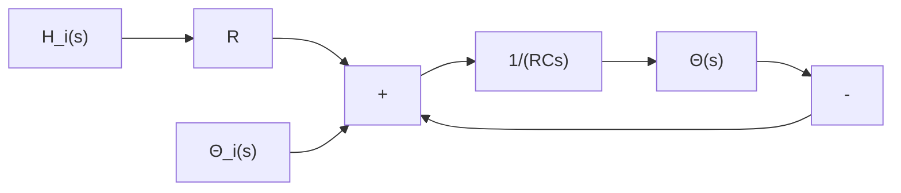

$$C = \frac {\text { change in heat stored, kcal }}{\text { change in temperature, } ^ {\circ} \mathrm{C}}$$

or

$$C = m c$$

where m=mass of substance considered, kg

$$c = \text { specific heat of substance, kcal / kg } ^ {\circ} \text { C }$$

Thermal System. Consider the system shown in Figure 4–26(a). It is assumed that the tank is insulated to eliminate heat loss to the surrounding air. It is also assumed that there is no heat storage in the insulation and that the liquid in the tank is perfectly mixed so that it is at a uniform temperature.Thus, a single temperature is used to describe the temperature of the liquid in the tank and of the outflowing liquid.

Let us define

$\overline { { \Theta } } _ { i }$ steady-state temperature of inflowing liquid,= $^ \circ \mathrm { C }$

$\overline { { \theta } } _ { o }$ steady-state temperature of outflowing liquid, °C=

steady-state liquid flow rate, kgsec G =

mass of liquid in tank, kg M =

specific heat of liquid, kcal c = $/ \mathrm { k g } ^ { \circ } \mathrm { C }$

thermal resistance, °C seckcal R =

thermal capacitance, kcal°C C =

$\bar { H }$ steady-state heat input rate, kcalsec=

Assume that the temperature of the inflowing liquid is kept constant and that the heat input rate to the system (heat supplied by the heater) is suddenly changed from $\bar { H }$ to $\textstyle { \bar { H } } + h _ { i }$ where , $h _ { i }$ represents a small change in the heat input rate.The heat outflow rate will then change gradually from $\bar { H }$ to $\smash { \overline { { H } } ^ { \mathrm { ~ ~ } } + h _ { o } }$ The temperature of the outflowing liq-. uid will also be changed from $\bar { \theta } _ { o }$ to $\bar { \Theta } _ { o } + \theta$ For this case,. $h _ { o } , C .$ , and R are obtained, respectively, as

$$h _ {o} = G c \thetaC = M cR = \frac {\theta}{h _ {o}} = \frac {1}{G c}$$

The heat-balance equation for this system is

$$C d \theta = (h _ {i} - h _ {o}) d t$$

Figure 4–26

(a) Thermal system: (b) block diagram of the system.

text_image

Heater
Mixer
Cold liquid
Hot liquid

(a)

flowchart

(b)

or

$$C \frac {d \theta}{d t} = h _ {i} - h _ {o}$$
