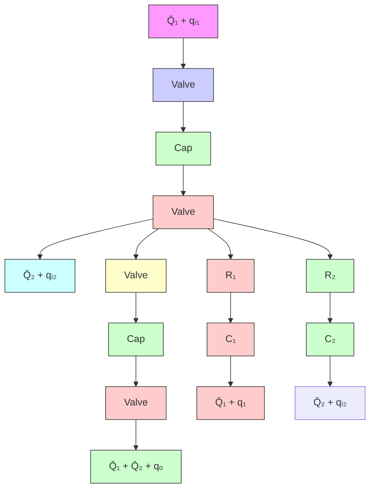

$$\frac {d h _ {1}}{d t} = \frac {1}{C _ {1}} \left(q _ {i 1} - \frac {h _ {1} - h _ {2}}{R _ {1}}\right) \tag {4-36}$$

Eliminating $q _ { 1 }$ and $q _ { o }$ from Equation (4–34) by using Equations (4–33) and (4–35) gives

$$\frac {d h _ {2}}{d t} = \frac {1}{C _ {2}} \left(\frac {h _ {1} - h _ {2}}{R _ {1}} + q _ {i 2} - \frac {h _ {2}}{R _ {2}}\right) \tag {4-37}$$

Define state variables $x _ { 1 }$ and $x _ { 2 }$ by

$$x _ {1} = h _ {1}x _ {2} = h _ {2}$$

the input variables $u _ { 1 }$ and $u _ { 2 }$ by

$$u _ {1} = q _ {i 1}u _ {2} = q _ {i 2}$$

and the output variables $y _ { 1 }$ and $y _ { 2 }$ by

$$y _ {1} = h _ {1} = x _ {1}y _ {2} = h _ {2} = x _ {2}$$

Then Equations (4–36) and (4–37) can be written as

$$\dot {x} _ {1} = - \frac {1}{R _ {1} C _ {1}} x _ {1} + \frac {1}{R _ {1} C _ {1}} x _ {2} + \frac {1}{C _ {1}} u _ {1}\dot {x} _ {2} = \frac {1}{R _ {1} C _ {2}} x _ {1} - \left(\frac {1}{R _ {1} C _ {2}} + \frac {1}{R _ {2} C _ {2}}\right) x _ {2} + \frac {1}{C _ {2}} u _ {2}$$

flowchart

Figure 4–28 Liquid-level system.

In the form of the standard vector-matrix representation, we have

$$
\left[ \begin{array}{c} \dot {x} _ {1} \\ \dot {x} _ {2} \end{array} \right] = \left[ \begin{array}{c c} - \frac {1}{R _ {1} C _ {1}} & \frac {1}{R _ {1} C _ {1}} \\ \frac {1}{R _ {1} C _ {2}} & - \left(\frac {1}{R _ {1} C _ {2}} + \frac {1}{R _ {2} C _ {2}}\right) \end{array} \right] \left[ \begin{array}{c} x _ {1} \\ x _ {2} \end{array} \right] + \left[ \begin{array}{c c} \frac {1}{C _ {1}} & 0 \\ 0 & \frac {1}{C _ {2}} \end{array} \right] \left[ \begin{array}{c} u _ {1} \\ u _ {2} \end{array} \right]
$$

which is the state equation, and
