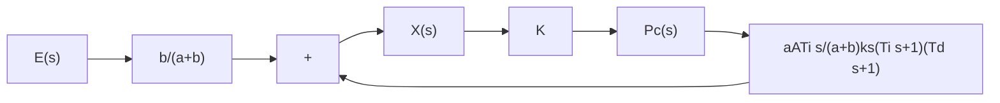

Note : The sum of gain block and summation points be calculated by adding a factor to the sum of gains from s - t - 1.
Note : The_sum_of_gain_block_and_summation_points_be_calculated_by_adding_a_function["k_s / (T_d * s + 1)"] = (k_s / (T_i * s + 1)) * (k_s / (T_d * s + 1)).
```
</details>

(a)   
Figure 4–31   
(a) Block diagram of the pneumatic controller shown in Figure 4–30; (b) simplified block diagram.


<details>
<summary>flowchart</summary>


</details>

(b)

Figure 4–32 (a) Overlapped spool valve; (b) underlapped spool valve.   


<details>
<summary>text_image</summary>

x
x₀/2
x₀/2
High
pressure
Low
pressure
</details>

(a)


<details>
<summary>text_image</summary>

x
x₀/2
x₀/2
High
pressure
Low
pressure
</details>

(b)

If the resistance $R _ { i }$ is removed, or $R _ { i } = 0 ,$ , the action becomes that of a narrow-band proportional, or two-position, controller. (Note that the actions of two feedback bellows cancel each other, and there is no feedback.)

A–4–6. Actual spool valves are either overlapped or underlapped because of manufacturing tolerances. Consider the overlapped and underlapped spool valves shown in Figures 4–32(a) and (b). Sketch curves relating the uncovered port area A versus displacement x.

Solution. For the overlapped valve, a dead zone exists between $- { \frac { 1 } { 2 } } x _ { 0 }$ and $\begin{array} { r } { \frac { 1 } { 2 } x _ { 0 } , \mathrm { o r } - \frac { 1 } { 2 } x _ { 0 } < x < \frac { 1 } { 2 } x _ { 0 } } \end{array}$ . The curve for uncovered port area A versus displacement x is shown in Figure 4–33(a). Such an overlapped valve is unfit as a control valve.

For the underlapped valve, the curve for port area A versus displacement x is shown in Figure 4–33(b). The effective curve for the underlapped region has a higher slope, meaning a higher sensitivity. Valves used for controls are usually underlapped.
