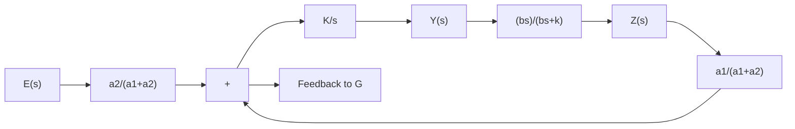

The controller produces the integral control action.

text_image

k
b
a2
a1
z
e
Oil under pressure
ω
y
Engine

Figure 4–35 Speed control system.

A–4–8. Explain the operation of the speed control system shown in Figure 4–35.

Solution. If the engine speed increases, the sleeve of the fly-ball governor moves upward. This movement acts as the input to the hydraulic controller.A positive error signal (upward motion of the sleeve) causes the power piston to move downward, reduces the fuel-valve opening, and decreases the engine speed. A block diagram for the system is shown in Figure 4–36.

From the block diagram the transfer function $Y ( s ) / E ( s )$ can be obtained as

$$\frac {Y (s)}{E (s)} = \frac {a _ {2}}{a _ {1} + a _ {2}} \frac {\frac {K}{s}}{1 + \frac {a _ {1}}{a _ {1} + a _ {2}} \frac {b s}{b s + k} \frac {K}{s}}$$

If the following condition applies,

$$\left| \frac {a _ {1}}{a _ {1} + a _ {2}} \frac {b s}{b s + k} \frac {K}{s} \right| \gg 1$$

the transfer function $Y ( s ) / E ( s )$ becomes

$$\frac {Y (s)}{E (s)} \doteq \frac {a _ {2}}{a _ {1} + a _ {2}} \frac {a _ {1} + a _ {2}}{a _ {1}} \frac {b s + k}{b s} = \frac {a _ {2}}{a _ {1}} \left(1 + \frac {k}{b s}\right)$$

The speed controller has proportional-plus-integral control action.

Figure 4–36 Block diagram for the speed control system shown in Figure 4–35.   

flowchart

A–4–9. Derive the transfer function $Z ( s ) / Y ( s )$ of the hydraulic system shown in Figure 4–37.Assume that the two dashpots in the system are identical ones except the piston shafts.

Solution. In deriving the equations for the system, we assume that force F is applied at the right end of the shaft causing displacement y. (All displacements y, w, and z are measured from respective equilibrium positions when no force is applied at the right end of the shaft.) When force $F$ is applied, pressure $P _ { 1 }$ becomes higher than pressure $P _ { 1 } ^ { \prime }$ , or $P _ { 1 } > P _ { 1 } ^ { \prime }$ Similarly,. $P _ { 2 } > P _ { 2 } ^ { \prime }$ .

For the force balance, we have the following equation:
