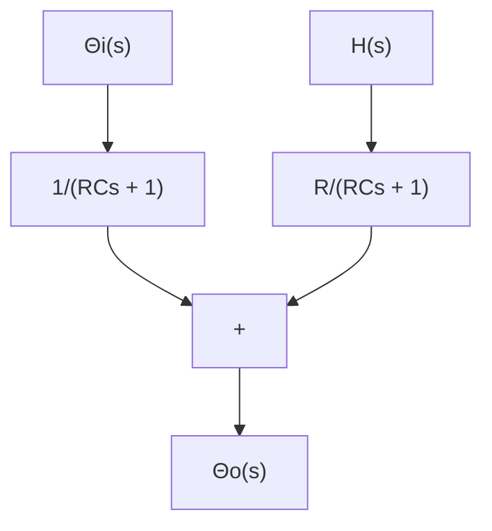

A–4–10. Considering small deviations from steady-state operation, draw a block diagram of the air heating system shown in Figure 4–38. Assume that the heat loss to the surroundings and the heat capacitance of the metal parts of the heater are negligible.

Solution. Let us define

$\overline { { \theta } } _ { i }$ steady-state temperature of inlet air,= $^ \circ \mathrm { C }$

$\bar { \theta } _ { o }$ steady-state temperature of outlet air,= $^ \circ \mathrm { C }$

G=mass flow rate of air through the heating chamber, kgsec

M=mass of air contained in the heating chamber, kg

c= specific heat of air, kcalkg °C

R= thermal resistance, °C seckcal

C=thermal capacitance of air contained in the heating chamber=Mc, kcal°C

steady-state heat input, kcalsecH– =

Let us assume that the heat input is suddenly changed from $\bar { H }$ to $\bar { H } + h$ and the inlet air temperature is suddenly changed from $\overline { { \theta } } _ { i }$ to $\bar { \Theta } _ { i } + \theta _ { i }$ Then the outlet air temperature will be. changed from $\bar { \theta } _ { o }$ to $\bar { \Theta } _ { o } + \theta _ { o }$ .

The equation describing the system behavior is

$$C d \theta_ {o} = \left[ h + G c \left(\theta_ {i} - \theta_ {o}\right) \right] d t$$

text_image

Heater
H + h
Θ̅i + θi
Θ̅o + θo

Figure 4–38   
Air heating system.

Figure 4–39   
Block diagram of the air heating system shown in Figure 4–38.   

flowchart

or

$$C \frac {d \theta_ {o}}{d t} = h + G c (\theta_ {i} - \theta_ {o})$$

Noting that

$$G c = \frac {1}{R}$$

we obtain

$$C \frac {d \theta_ {o}}{d t} = h + \frac {1}{R} \left(\theta_ {i} - \theta_ {o}\right)$$

or

$$R C \frac {d \theta_ {o}}{d t} + \theta_ {o} = R h + \theta_ {i}$$

Taking the Laplace transforms of both sides of this last equation and substituting the initial condition that $\theta _ { 0 } ( 0 ) = 0 { } ~$ , we obtain

$$\Theta_ {o} (s) = \frac {R}{R C s + 1} H (s) + \frac {1}{R C s + 1} \Theta_ {i} (s)$$

The block diagram of the system corresponding to this equation is shown in Figure 4–39.
