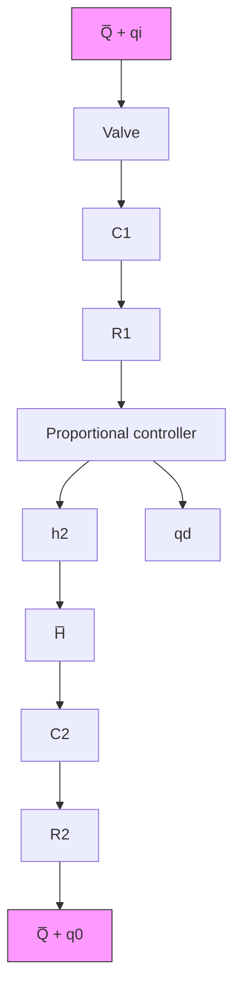

# PROBLEMS

B–4–1. Consider the conical water-tank system shown in Figure 4–42. The flow through the valve is turbulent and is related to the head H by

$$Q = 0. 0 0 5 \sqrt {H}$$

where Q is the flow rate measured in m3 sec and H is in meters.

Suppose that the head is 2 m at t=0. What will be the head at $t = 6 0 \mathrm { s e c ? }$

text_image

2m
3m
r
H
2m

Figure 4–42 Conical water-tank system.

B–4–2. Consider the liquid-level control system shown in Figure 4–43. The controller is of the proportional type. The set point of the controller is fixed.

Draw a block diagram of the system, assuming that changes in the variables are small. Obtain the transfer function between the level of the second tank and the disturbance input $q _ { d } .$ Obtain the steady-state error when the disturbance $q _ { d }$ is a unit-step function.

B–4–3. For the pneumatic system shown in Figure 4–44, assume that steady-state values of the air pressure and the displacement of the bellows are andP – $\bar { X }$ respectively., Assume also that the input pressure is changed from $\bar { P }$ to ${ \overline { { P } } } + p _ { i } ,$ where , $p _ { i }$ is a small change in the input pressure.This change will cause the displacement of the bellows to change a small amount x.Assuming that the capacitance of the bellows is C and the resistance of the valve is $R ,$ obtain the transfer function relating x and $p _ { i }$ .

flowchart

Figure 4–43 Liquid-level control system.

text_image

P̄ + pᵢ
R
C
X̄ + x
k
A
P̄ + pₒ

Figure 4–44 Pneumatic system.

B–4–4. Figure 4–45 shows a pneumatic controller.The pneumatic relay has the characteristic that $p _ { c } = K p _ { b }$ , where $K > 0 ,$ . What kind of control action does this controller produce? Derive the transfer function $P _ { c } ( s ) / E ( s )$ .
