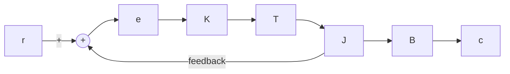
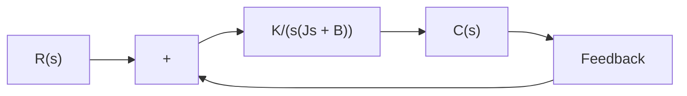

# 5–3 SECOND-ORDER SYSTEMS

In this section, we shall obtain the response of a typical second-order control system to a step input, ramp input, and impulse input. Here we consider a servo system as an example of a second-order system.

Servo System. The servo system shown in Figure 5–5(a) consists of a proportional controller and load elements (inertia and viscous-friction elements). Suppose that we wish to control the output position c in accordance with the input position r.

The equation for the load elements is

$$J \ddot {c} + B \dot {c} = T$$

where T is the torque produced by the proportional controller whose gain is K. By taking Laplace transforms of both sides of this last equation, assuming the zero initial conditions, we obtain

$$J s ^ {2} C (s) + B s C (s) = T (s)$$

So the transfer function between C(s) and T(s) is

$$\frac {C (s)}{T (s)} = \frac {1}{s (J s + B)}$$

By using this transfer function, Figure 5–5(a) can be redrawn as in Figure 5–5(b), which can be modified to that shown in Figure 5–5(c).The closed-loop transfer function is then obtained as

$$\frac {C (s)}{R (s)} = \frac {K}{J s ^ {2} + B s + K} = \frac {K / J}{s ^ {2} + (B / J) s + (K / J)}$$

Such a system where the closed-loop transfer function possesses two poles is called a second-order system. (Some second-order systems may involve one or two zeros.)


<details>
<summary>flowchart</summary>


</details>

(a)


<details>
<summary>flowchart</summary>

```mermaid
graph LR
    R["s"] --> |+| Sum
    Sum --> K["K"]
    K --> T["s"]
    T["s"] --> |1/(s(Js + B))| C["s"]
    C["s"] --> |feedback| Sum
```
</details>


<details>
<summary>flowchart</summary>


</details>

(c)   
Figure 5–5

(a) Servo system;

(b) block diagram;

(c) simplified block diagram.

Step Response of Second-Order System. The closed-loop transfer function of the system shown in Figure 5–5(c) is

$$\frac {C (s)}{R (s)} = \frac {K}{J s ^ {2} + B s + K} \tag {5-9}$$

which can be rewritten as
