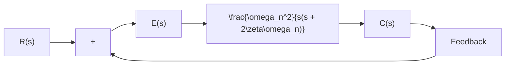

$$\frac {C (s)}{R (s)} = \frac {\frac {K}{J}}{\left[ s + \frac {B}{2 J} + \sqrt {\left(\frac {B}{2 J}\right) ^ {2} - \frac {K}{J}} \right] \left[ s + \frac {B}{2 J} - \sqrt {\left(\frac {B}{2 J}\right) ^ {2} - \frac {K}{J}} \right]}$$

The closed-loop poles are complex conjugates if $B ^ { 2 } - 4 J K < 0$ and they are real if $B ^ { 2 } - 4 J K \geq 0$ . In the transient-response analysis, it is convenient to write

$$\frac {K}{J} = \omega_ {n} ^ {2}, \quad \frac {B}{J} = 2 \zeta \omega_ {n} = 2 \sigma$$

where $\sigma$ is called the attenuation; $\omega _ { n }$ , the undamped natural frequency; and z, the damping ratio of the system. The damping ratio $\zeta$ is the ratio of the actual damping B to the critical damping $B _ { c } = 2 \sqrt { J K }$ or

$$\zeta = \frac {B}{B _ {c}} = \frac {B}{2 \sqrt {J K}}$$

Figure 5–6 Second-order system.   

flowchart

In terms of $\zeta$ and $\omega _ { n } ;$ , the system shown in Figure 5–5(c) can be modified to that shown in Figure 5–6, and the closed-loop transfer function $C ( s ) / R ( s )$ given by Equation (5–9) can be written

$$\frac {C (s)}{R (s)} = \frac {\omega_ {n} ^ {2}}{s ^ {2} + 2 \zeta \omega_ {n} s + \omega_ {n} ^ {2}} \tag {5-10}$$

This form is called the standard form of the second-order system.

The dynamic behavior of the second-order system can then be described in terms of two parameters $\zeta$ and $\omega _ { n } . \operatorname { I f } 0 < \zeta < 1$ , the closed-loop poles are complex conjugates and lie in the left-half s plane. The system is then called underdamped, and the transient response is oscillatory. If $\zeta = 0$ , the transient response does not die out. If $\zeta = 1$ , the system is called critically damped. Overdamped systems correspond to $\zeta > 1$ .

We shall now solve for the response of the system shown in Figure 5–6 to a unit-step input. We shall consider three different cases: the underdamped $( 0 < \zeta < 1 )$ , critically damped $( \zeta = 1 )$ , and overdamped $( \zeta > 1 )$ cases.

(1) Underdamped case $( 0 < \zeta < 1 )$ : In this case, $C ( s ) / R ( s )$ can be written

$$\frac {C (s)}{R (s)} = \frac {\omega_ {n} ^ {2}}{(s + \zeta \omega_ {n} + j \omega_ {d}) (s + \zeta \omega_ {n} - j \omega_ {d})}$$
