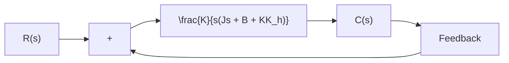

flowchart

(b)   
Figure 5–13 (a) Block diagram of a servo system; (b) simplified block diagram.

The tachometer, a special dc generator, is frequently used to measure velocity without differentiation process. The output of a tachometer is proportional to the angular velocity of the motor.

Consider the servo system shown in Figure 5–13(a). In this device, the velocity signal, together with the positional signal, is fed back to the input to produce the actuating error signal. In any servo system, such a velocity signal can be easily generated by a tachometer. The block diagram shown in Figure 5–13(a) can be simplified, as shown in Figure 5–13(b), giving

$$\frac {C (s)}{R (s)} = \frac {K}{J s ^ {2} + (B + K K _ {h}) s + K} \tag {5-24}$$

Comparing Equation (5–24) with Equation (5–9), notice that the velocity feedback has the effect of increasing damping. The damping ratio $\zeta$ becomes

$$\zeta = \frac {B + K K _ {h}}{2 \sqrt {K J}} \tag {5-25}$$

The undamped natural frequency $\omega _ { n } = \sqrt { K / J }$ is not affected by velocity feedback. Noting that the maximum overshoot for a unit-step input can be controlled by controlling the value of the damping ratio z, we can reduce the maximum overshoot by adjusting the velocity-feedback constant $K _ { h }$ so that $\zeta$ is between 0.4 and 0.7.

It is important to remember that velocity feedback has the effect of increasing the damping ratio without affecting the undamped natural frequency of the system.
