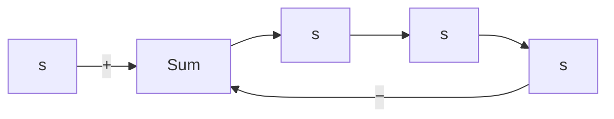

Figure 5–16 Control system.

C(s). If there is a closed-loop zero close to a closed-loop pole, then the residue at this pole is small and the coefficient of the transient-response term corresponding to this pole becomes small. A pair of closely located poles and zeros will effectively cancel each other. If a pole is located very far from the origin, the residue at this pole may be small. The transients corresponding to such a remote pole are small and last a short time.Terms in the expanded form of $C ( s )$ having very small residues contribute little to the transient response, and these terms may be neglected. If this is done, the higher-order system may be approximated by a lower-order one. (Such an approximation often enables us to estimate the response characteristics of a higher-order system from those of a simplified one.)

Next, consider the case where the poles of $C ( s )$ consist of real poles and pairs of complex-conjugate poles.A pair of complex-conjugate poles yields a second-order term in s. Since the factored form of the higher-order characteristic equation consists of firstand second-order terms, Equation (5–33) can be rewritten

$$C (s) = \frac {a}{s} + \sum_ {j = 1} ^ {q} \frac {a _ {j}}{s + p _ {j}} + \sum_ {k = 1} ^ {r} \frac {b _ {k} \left(s + \zeta_ {k} \omega_ {k}\right) + c _ {k} \omega_ {k} \sqrt {1 - \zeta_ {k} ^ {2}}}{s ^ {2} + 2 \zeta_ {k} \omega_ {k} s + \omega_ {k} ^ {2}} \quad (q + 2 r = n)$$

where we assumed all closed-loop poles are distinct. [If the closed-loop poles involve multiple poles, $C ( s )$ must have multiple-pole terms.] From this last equation, we see that the response of a higher-order system is composed of a number of terms involving the simple functions found in the responses of first- and second-order systems. The unitstep response c(t), the inverse Laplace transform of C(s), is then

$$
\begin{array}{l} c (t) = a + \sum_ {j = 1} ^ {q} a _ {j} e ^ {- p _ {j} t} + \sum_ {k = 1} ^ {r} b _ {k} e ^ {- \zeta_ {k} \omega_ {k} t} \cos \omega_ {k} \sqrt {1 - \zeta_ {k} ^ {2}} t \\ + \sum_ {k = 1} ^ {r} c _ {k} e ^ {- \zeta_ {k} \omega_ {k} t} \sin \omega_ {k} \sqrt {1 - \zeta_ {k} ^ {2}} t, \quad \text { for } t \geq 0 \tag {5-34} \\ \end{array}
$$

Thus the response curve of a stable higher-order system is the sum of a number of exponential curves and damped sinusoidal curves.
