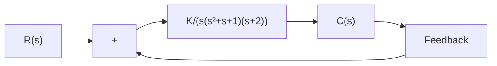

$$(s + 1) (s - 1) (s + j 5) (s - j 5) (s + 2) = 0$$

Clearly, the original equation has one root with a positive real part.

Relative Stability Analysis. Routh’s stability criterion provides the answer to the question of absolute stability. This, in many practical cases, is not sufficient. We usually require information about the relative stability of the system. A useful approach for examining relative stability is to shift the s-plane axis and apply Routh’s stability criterion. That is, we substitute

$$s = \hat {s} - \sigma \quad (\sigma = \text { constant })$$

into the characteristic equation of the system, write the polynomial in terms of ${ \hat { s } } ;$ and apply Routh’s stability criterion to the new polynomial in The number of changes ofsˆ. sign in the first column of the array developed for the polynomial in is equal to the num-sˆ ber of roots that are located to the right of the vertical line s=–s.Thus, this test reveals the number of roots that lie to the right of the vertical line s=–s.

Application of Routh’s Stability Criterion to Control-System Analysis. Routh’s stability criterion is of limited usefulness in linear control-system analysis, mainly because it does not suggest how to improve relative stability or how to stabilize an unstable system. It is possible, however, to determine the effects of changing one or two parameters of a system by examining the values that cause instability. In the following, we shall consider the problem of determining the stability range of a parameter value.

Consider the system shown in Figure 5–35. Let us determine the range of K for stability. The closed-loop transfer function is

$$\frac {C (s)}{R (s)} = \frac {K}{s (s ^ {2} + s + 1) (s + 2) + K}$$

The characteristic equation is

$$s ^ {4} + 3 s ^ {3} + 3 s ^ {2} + 2 s + K = 0$$

The array of coefficients becomes

$$
\begin{array}{l} s ^ {4} \qquad 1 \qquad 3 \quad K \\ s ^ {3} \quad 3 \quad 2 \quad 0 \\ s ^ {2} \quad \frac {7}{3} \quad K \\ s ^ {1} \quad 2 - \frac {9}{7} K \\ s ^ {0} \quad K \\ \end{array}
$$

flowchart

Figure 5–35 Control system.

For stability, K must be positive, and all coefficients in the first column must be positive. Therefore,

$$\frac {1 4}{9} > K > 0$$

When $\begin{array} { r } { K = \frac { 1 4 } { 9 } } \end{array}$ the system becomes oscillatory and, mathematically, the oscillation is, sustained at constant amplitude.

Note that the ranges of design parameters that lead to stability may be determined by use of Routh’s stability criterion.
