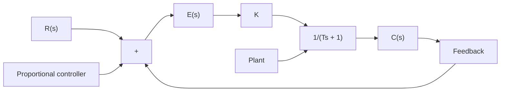
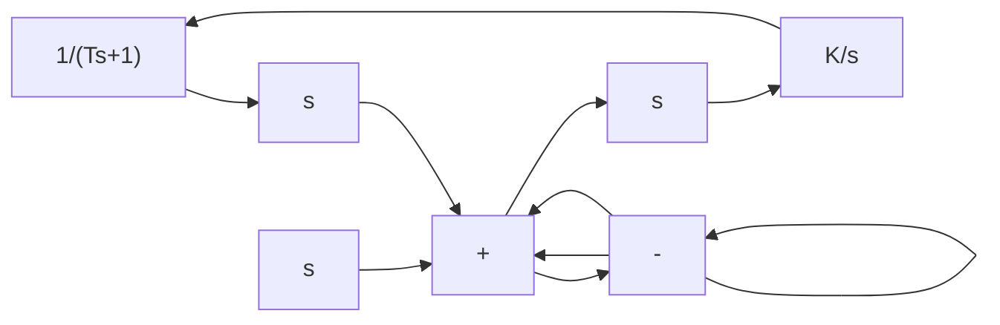

line

| t | u(t) |
| --- | --- |
| 0 | 0.8 |
| ∞ | 0.0 |

Figure 5–37   
Proportional control system.   

flowchart

Proportional Control of Systems. We shall show that the proportional control of a system without an integrator will result in a steady-state error with a step input. We shall then show that such an error can be eliminated if integral control action is included in the controller.

Consider the system shown in Figure 5–37. Let us obtain the steady-state error in the unit-step response of the system. Define

$$G (s) = \frac {K}{T s + 1}$$

Since

$$\frac {E (s)}{R (s)} = \frac {R (s) - C (s)}{R (s)} = 1 - \frac {C (s)}{R (s)} = \frac {1}{1 + G (s)}$$

the error E(s) is given by

$$E (s) = \frac {1}{1 + G (s)} R (s) = \frac {1}{1 + \frac {K}{T s + 1}} R (s)$$

For the unit-step input R(s)=1/s, we have

$$E (s) = \frac {T s + 1}{T s + 1 + K} \frac {1}{s}$$

The steady-state error is

$$e _ {\mathrm{ss}} = \lim _ {t \rightarrow \infty} e (t) = \lim _ {s \rightarrow 0} s E (s) = \lim _ {s \rightarrow 0} \frac {T s + 1}{T s + 1 + K} = \frac {1}{K + 1}$$

Such a system without an integrator in the feedforward path always has a steady-state error in the step response. Such a steady-state error is called an offset. Figure 5–38 shows the unit-step response and the offset.

line

| t | c(t) |
| --- | --- |
| 0 | 0 |
| >1 | 1 |

Figure 5–38   
Unit-step response and offset.

Figure 5–39   
Integral control system.   

flowchart

Integral Control of Systems. Consider the system shown in Figure 5–39. The controller is an integral controller. The closed-loop transfer function of the system is
