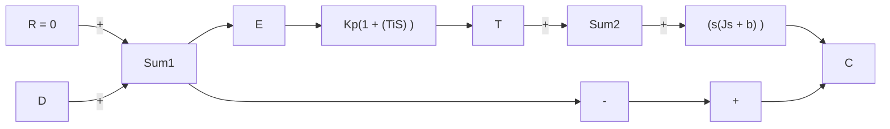

Response to Torque Disturbances (Proportional-Plus-Integral Control). To eliminate offset due to torque disturbance, the proportional controller may be replaced by a proportional-plus-integral controller.

If integral control action is added to the controller, then, as long as there is an error signal, a torque is developed by the controller to reduce this error, provided the control system is a stable one.

Figure 5–41 shows the proportional-plus-integral control of the load element, consisting of moment of inertia and viscous friction.

The closed-loop transfer function between C(s) and $D ( s )$ is

$$\frac {C (s)}{D (s)} = \frac {s}{J s ^ {3} + b s ^ {2} + K _ {p} s + \frac {K _ {p}}{T _ {i}}}$$

In the absence of the reference input, or $r ( t ) = 0$ , the error signal is obtained from

$$E (s) = - \frac {s}{J s ^ {3} + b s ^ {2} + K _ {p} s + \frac {K _ {p}}{T _ {i}}} D (s)$$

Figure 5–41

Proportional-plusintegral control of a load element consisting of moment of inertia and viscous friction.


<details>
<summary>flowchart</summary>


</details>

Figure 5–42 Integral control of a load element consisting of moment of inertia and viscous friction.   


<details>
<summary>flowchart</summary>

```mermaid
graph LR
    R[" R = 0 "] --> |+| Sum1
    Sum1 --> E[" E "]
    E --> K[" K/s "]
    K --> T[" T "]
    T --> |+| Sum2
    D[" D "] --> |+| Sum2
    Sum2 --> |1/(s(Js + b))| C[" C "]
    C --> |feedback| Sum1
```
</details>

If this control system is stable—that is, if the roots of the characteristic equation

$$J s ^ {3} + b s ^ {2} + K _ {p} s + \frac {K _ {p}}{T _ {i}} = 0$$

have negative real parts—then the steady-state error in the response to a unit-step disturbance torque can be obtained by applying the final-value theorem as follows:

$$
\begin{array}{l} e _ {\mathrm{ss}} = \lim _ {s \rightarrow 0} s E (s) \\ = \lim _ {s \rightarrow 0} \frac {- s ^ {2}}{J s ^ {3} + b s ^ {2} + K _ {p} s + \frac {K _ {p}}{T _ {i}}} \frac {1}{s} \\ = 0 \\ \end{array}
$$

Thus steady-state error to the step disturbance torque can be eliminated if the controller is of the proportional-plus-integral type.
