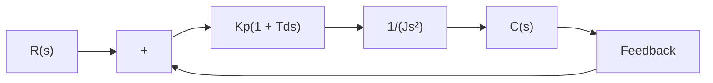

Because derivative control operates on the rate of change of the actuating error and not the actuating error itself, this mode is never used alone. It is always used in combination with proportional or proportional-plus-integral control action.

Proportional Control of Systems with Inertia Load. Before we discuss further the effect of derivative control action on system performance, we shall consider the proportional control of an inertia load.

Consider the system shown in Figure 5–43(a). The closed-loop transfer function is obtained as

$$\frac {C (s)}{R (s)} = \frac {K _ {p}}{J s ^ {2} + K _ {p}}$$

Since the roots of the characteristic equation

$$J s ^ {2} + K _ {p} = 0$$

are imaginary, the response to a unit-step input continues to oscillate indefinitely, as shown in Figure 5–43(b).

Control systems exhibiting such response characteristics are not desirable. We shall see that the addition of derivative control will stabilize the system.

Proportional-Plus-Derivative Control of a System with Inertia Load. Let us modify the proportional controller to a proportional-plus-derivative controller whose transfer function is $K _ { p } { \big ( } 1 + T _ { d } s { \big ) }$ The torque developed by the controller is proportional. to $K _ { p } ( e + T _ { d } \dot { e } )$ Derivative control is essentially anticipatory, measures the instantaneous. error velocity, and predicts the large overshoot ahead of time and produces an appropriate counteraction before too large an overshoot occurs.

flowchart

(a)

line

| t | c(t) |
| --- | --- |
| 0 | 0 |
| >0 | 1 |

(b)   
Figure 5–44   
(a) Proportional-plus-derivative control of a system with inertia load; (b) response to a unit-step input.

Consider the system shown in Figure 5–44(a). The closed-loop transfer function is given by

$$\frac {C (s)}{R (s)} = \frac {K _ {p} \bigl (1 + T _ {d} s \bigr)}{J s ^ {2} + K _ {p} T _ {d} s + K _ {p}}$$

The characteristic equation

$$J s ^ {2} + K _ {p} T _ {d} s + K _ {p} = 0$$
