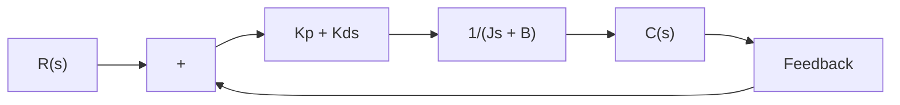

now has two roots with negative real parts for positive values of J, $K _ { p } ,$ , and $T _ { d }$ Thus. derivative control introduces a damping effect. A typical response curve $c ( t )$ to a unitstep input is shown in Figure 5–44(b). Clearly, the response curve shows a marked improvement over the original response curve shown in Figure 5–46(b).

Proportional-Plus-Derivative Control of Second-Order Systems. A compromise between acceptable transient-response behavior and acceptable steady-state behavior may be achieved by use of proportional-plus-derivative control action.

Consider the system shown in Figure 5–45. The closed-loop transfer function is

$$\frac {C (s)}{R (s)} = \frac {K _ {p} + K _ {d} s}{J s ^ {2} + (B + K _ {d}) s + K _ {p}}$$

The steady-state error for a unit-ramp input is

$$e _ {\mathrm{ss}} = \frac {B}{K _ {p}}$$

The characteristic equation is

$$J s ^ {2} + (B + K _ {d}) s + K _ {p} = 0$$

flowchart

Figure 5–45 Control system.

The effective damping coefficient of this system is thus $B + K _ { d }$ rather than B. Since the damping ratio $\zeta$ of this system is

$$\zeta = \frac {B + K _ {d}}{2 \sqrt {K _ {p} J}}$$

it is possible to make both the steady-state error $e _ { \mathrm { s s } }$ for a ramp input and the maximum overshoot for a step input small by making B small, $K _ { p }$ large, and $K _ { d }$ large enough so that $\zeta$ is between 0.4 and 0.7.
