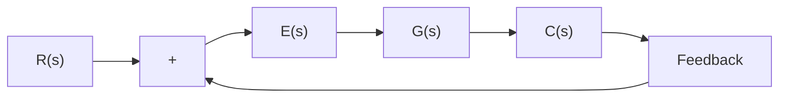

We shall see later that, if $G ( s )$ is written so that each term in the numerator and denominator, except the term $s ^ { N }$ , approaches unity as s approaches zero, then the openloop gain K is directly related to the steady-state error.

Figure 5–46 Control system.   

flowchart

Steady-State Errors. Consider the system shown in Figure 5–46.The closed-loop transfer function is

$$\frac {C (s)}{R (s)} = \frac {G (s)}{1 + G (s)}$$

The transfer function between the error signal e(t) and the input signal r(t) is

$$\frac {E (s)}{R (s)} = 1 - \frac {C (s)}{R (s)} = \frac {1}{1 + G (s)}$$

where the error $e ( t )$ is the difference between the input signal and the output signal.

The final-value theorem provides a convenient way to find the steady-state performance of a stable system. Since E(s) is

$$E (s) = \frac {1}{1 + G (s)} R (s)$$

the steady-state error is

$$e _ {\mathrm{ss}} = \lim _ {t \rightarrow \infty} e (t) = \lim _ {s \rightarrow 0} s E (s) = \lim _ {s \rightarrow 0} \frac {s R (s)}{1 + G (s)}$$

The static error constants defined in the following are figures of merit of control systems. The higher the constants, the smaller the steady-state error. In a given system, the output may be the position, velocity, pressure, temperature, or the like. The physical form of the output, however, is immaterial to the present analysis. Therefore, in what follows, we shall call the output “position,” the rate of change of the output “velocity,” and so on. This means that in a temperature control system “position” represents the output temperature,“velocity” represents the rate of change of the output temperature, and so on.

Static Position Error Constant $K _ { p } .$ . The steady-state error of the system for a unit-step input is

$$
\begin{array}{l} e _ {\mathrm{ss}} = \lim _ {s \rightarrow 0} \frac {s}{1 + G (s)} \frac {1}{s} \\ = \frac {1}{1 + G (0)} \\ \end{array}
$$

The static position error constant $K _ { p }$ is defined by

$$K _ {p} = \lim _ {s \rightarrow 0} G (s) = G (0)$$

Thus, the steady-state error in terms of the static position error constant $K _ { p }$ is given by

$$e _ {\mathrm{ss}} = \frac {1}{1 + K _ {p}}$$

For a type 0 system,
