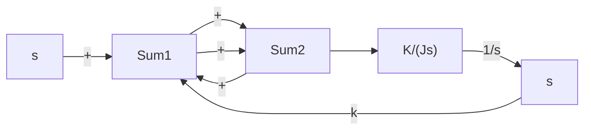

A–5–4. Determine the values of K and k of the closed-loop system shown in Figure 5–53 so that the maximum overshoot in unit-step response is 25% and the peak time is 2 sec.Assume that $J = 1 \mathrm { k g } \mathrm { - m } ^ { 2 }$ .

Solution. The closed-loop transfer function is

$$\frac {C (s)}{R (s)} = \frac {K}{J s ^ {2} + K k s + K}$$

By substituting $J = 1 \mathrm { k g } \mathrm { - m } ^ { 2 }$ into this last equation, we have

$$\frac {C (s)}{R (s)} = \frac {K}{s ^ {2} + K k s + K}$$

Note that in this problem

$$\omega_ {n} = \sqrt {K}, \quad 2 \zeta \omega_ {n} = K k$$

The maximum overshoot $M _ { p }$ is

$$M _ {p} = e ^ {- \zeta \pi / \sqrt {1 - \zeta^ {2}}}$$

which is specified as 25%. Hence

$$e ^ {- \zeta \pi / \sqrt {1 - \zeta^ {2}}} = 0. 2 5$$

from which

$$\frac {\zeta \pi}{\sqrt {1 - \zeta^ {2}}} = 1. 3 8 6$$

flowchart

Figure 5–53 Closed-loop system.

or

$$\zeta = 0. 4 0 4$$

The peak time $t _ { p }$ is specified as 2 sec. And so

$$t _ {p} = \frac {\pi}{\omega_ {d}} = 2$$

or

$$\omega_ {d} = 1. 5 7$$

Then the undamped natural frequency $\omega _ { n }$ is

$$\omega_ {n} = \frac {\omega_ {d}}{\sqrt {1 - \zeta^ {2}}} = \frac {1 . 5 7}{\sqrt {1 - 0 . 4 0 4 ^ {2}}} = 1. 7 2$$

Therefore, we obtain

$$K = \omega_ {n} ^ {2} = 1. 7 2 ^ {2} = 2. 9 5 \mathrm{N-m}k = \frac {2 \zeta \omega_ {n}}{K} = \frac {2 \times 0 . 4 0 4 \times 1 . 7 2}{2 . 9 5} = 0. 4 7 1 \mathrm{sec}$$

A–5–5. Figure 5–54(a) shows a mechanical vibratory system.When 2 lb of force (step input) is applied to the system, the mass oscillates, as shown in Figure 5–54(b). Determine m, b, and k of the system from this response curve. The displacement x is measured from the equilibrium position.

Solution. The transfer function of this system is

$$\frac {X (s)}{P (s)} = \frac {1}{m s ^ {2} + b s + k}$$

Since

$$P (s) = \frac {2}{s}$$

we obtain

$$X (s) = \frac {2}{s \left(m s ^ {2} + b s + k\right)}$$

It follows that the steady-state value of x is

$$x (\infty) = \lim _ {s \rightarrow 0} s X (s) = \frac {2}{k} = 0. 1 \mathrm{ft}$$

text_image

k
P(2-lb force)
m
x
b

(a)

