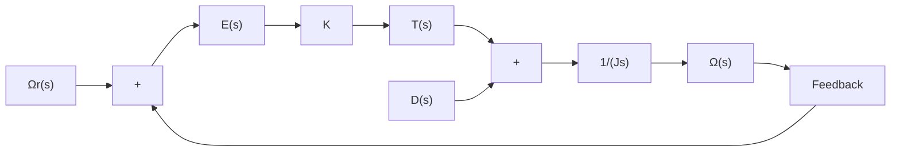
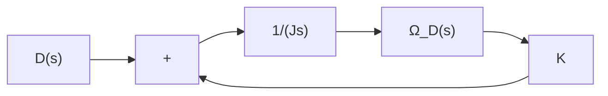

flowchart

Figure 5–67 Block diagram of a speed control system.

Investigate the response of this system to a unit-step disturbance torque. Assume that the reference input is zero, or $\varOmega _ { r } ( s ) = 0$ .

Solution. Figure 5–68 is a modified block diagram convenient for the present analysis.The closedloop transfer function is

$$\frac {\Omega_ {D} (s)}{D (s)} = \frac {1}{J s + K}$$

where $\varOmega _ { D } ( s )$ is the Laplace transform of the output speed due to the disturbance torque. For a unitstep disturbance torque, the steady-state output velocity is

$$
\begin{array}{l} \omega_ {D} (\infty) = \lim _ {s \rightarrow 0} s \Omega_ {D} (s) \\ = \lim _ {s \rightarrow 0} \frac {s}{J s + K} \frac {1}{s} \\ = \frac {1}{K} \\ \end{array}
$$

From this analysis, we conclude that, if a step disturbance torque is applied to the output member of the system, an error speed will result so that the ensuing motor torque will exactly cancel the disturbance torque. To develop this motor torque, it is necessary that there be an error in speed so that nonzero torque will result. (Discussions continue to Problem A–5–24.)

Figure 5–68 Block diagram of the speed control system of Figure 5–67 when $\Omega _ { r } ( s ) = 0 .$ .   

flowchart

A–5–24. In the system considered in Problem A–5–23, it is desired to eliminate as much as possible the speed errors due to torque disturbances.

Is it possible to cancel the effect of a disturbance torque at steady state so that a constant disturbance torque applied to the output member will cause no speed change at steady state?

Solution. Suppose that we choose a suitable controller whose transfer function is $G _ { c } ( s )$ , as shown in Figure 5–69. Then in the absence of the reference input the closed-loop transfer function between the output velocity $\varOmega _ { D } ( s )$ and the disturbance torque $D ( s )$ is
