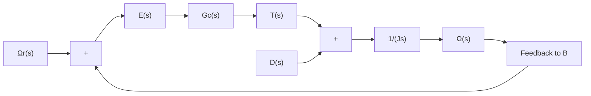
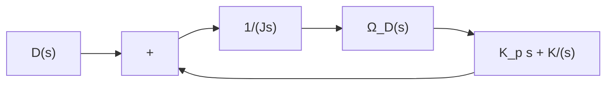

$$
\begin{array}{l} \frac {\Omega_ {D} (s)}{D (s)} = \frac {\frac {1}{J s}}{1 + \frac {1}{J s} G _ {c} (s)} \\ = \frac {1}{J s + G _ {c} (s)} \\ \end{array}
$$

The steady-state output speed due to a unit-step disturbance torque is

$$
\begin{array}{l} \omega_ {D} (\infty) = \lim _ {s \rightarrow 0} s \Omega_ {D} (s) \\ = \lim _ {s \rightarrow 0} \frac {s}{J s + G _ {c} (s)} \frac {1}{s} \\ = \frac {1}{G _ {c} (0)} \\ \end{array}
$$

To satisfy the requirement that

$$\omega_ {D} (\infty) = 0$$

we must choose $G _ { c } ( 0 ) = \infty .$ . This can be realized if we choose

$$G _ {c} (s) = \frac {K}{s}$$

Integral control action will continue to correct until the error is zero. This controller, however, presents a stability problem, because the characteristic equation will have two imaginary roots.

One method of stabilizing such a system is to add a proportional mode to the controller or choose

$$G _ {c} (s) = K _ {p} + \frac {K}{s}$$

flowchart

Figure 5–69 Block diagram of a speed control system.

Figure 5–70 Block diagram of the speed control system of Figure 5–69 when $G _ { c } ( s ) = K _ { p } + ( K / s )$ and $\varOmega _ { r } ( s ) \bar { = } 0 .$ .   

flowchart

With this controller, the block diagram of Figure 5–69 in the absence of the reference input can be modified to that of Figure 5–70. The closed-loop transfer function $\Omega _ { D } ( s ) / D ( s )$ becomes

$$\frac {\Omega_ {D} (s)}{D (s)} = \frac {s}{J s ^ {2} + K _ {p} s + K}$$

For a unit-step disturbance torque, the steady-state output speed is

$$\omega_ {D} (\infty) = \lim _ {s \rightarrow 0} s \Omega_ {D} (s) = \lim _ {s \rightarrow 0} \frac {s ^ {2}}{J s ^ {2} + K _ {p} s + K} \frac {1}{s} = 0$$

Thus, we see that the proportional-plus-integral controller eliminates speed error at steady state.

The use of integral control action has increased the order of the system by 1. (This tends to produce an oscillatory response.)
