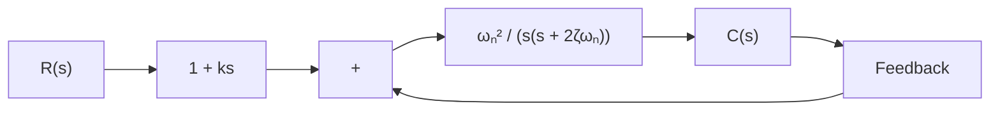

In the present system, a step disturbance torque will cause a transient error in the output speed, but the error will become zero at steady state. The integrator provides a nonzero output with zero error. (The nonzero output of the integrator produces a motor torque that exactly cancels the disturbance torque.)

Note that even if the system may have an integrator in the plant (such as an integrator in the transfer function of the plant), this does not eliminate the steady-state error due to a step disturbance torque.To eliminate this, we must have an integrator before the point where the disturbance torque enters.

A–5–25. Consider the system shown in Figure 5–71(a). The steady-state error to a unit-ramp input is $e _ { \mathrm { s s } } = 2 \zeta / \omega _ { n }$ . Show that the steady-state error for following a ramp input may be eliminated if the input is introduced to the system through a proportional-plus-derivative filter, as shown in Figure 5–71(b), and the value of k is properly set. Note that the error e(t) is given by $\boldsymbol { r } ( t ) - \boldsymbol { c } ( t )$ .

Solution. The closed-loop transfer function of the system shown in Figure 5–71(b) is

$$\frac {C (s)}{R (s)} = \frac {(1 + k s) \omega_ {n} ^ {2}}{s ^ {2} + 2 \zeta \omega_ {n} s + \omega_ {n} ^ {2}}$$

Then

$$R (s) - C (s) = \left(\frac {s ^ {2} + 2 \zeta \omega_ {n} s - \omega_ {n} ^ {2} k s}{s ^ {2} + 2 \zeta \omega_ {n} s + \omega_ {n} ^ {2}}\right) R (s)$$

Figure 5–71 (a) Control system; (b) control system with input filter.   

flowchart

(a)

flowchart

(b)

If the input is a unit ramp, then the steady-state error is

$$
\begin{array}{l} e (\infty) = r (\infty) - c (\infty) \\ = \lim _ {s \rightarrow 0} s \left(\frac {s ^ {2} + 2 \zeta \omega_ {n} s - \omega_ {n} ^ {2} k s}{s ^ {2} + 2 \zeta \omega_ {n} s + \omega_ {n} ^ {2}}\right) \frac {1}{s ^ {2}} \\ = \frac {2 \zeta \omega_ {n} - \omega_ {n} ^ {2} k}{\omega_ {n} ^ {2}} \\ \end{array}
$$

Therefore, if k is chosen as

$$k = \frac {2 \zeta}{\omega_ {n}}$$
