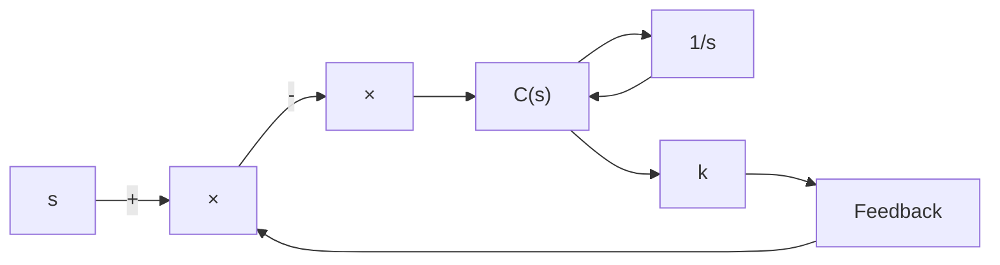

Determine the value of $K _ { h }$ so that the damping ratio of the system is 0.5. Draw unit-step response curves of both the original and tachometer-feedback systems. Also draw the error-versus-time curves for the unit-ramp response of both systems.

  
Figure 5–74 (a) Control system; (b) control system with tachometer feedback.

B–5–8. Referring to the system shown in Figure 5–75, determine the values of K and k such that the system has a damping ratio z of 0.7 and an undamped natural frequency $\omega _ { n }$ of 4 radsec.

B–5–9. Consider the system shown in Figure 5–76. Determine the value of k such that the damping ratio z is 0.5.Then obtain the rise time $t _ { r }$ , peak time $t _ { p } .$ maximum overshoot $M _ { p }$ , and settling time $t _ { s }$ in the unit-step response.

B–5–10. Using MATLAB, obtain the unit-step response, unit-ramp response, and unit-impulse response of the following system:

$$\frac {C (s)}{R (s)} = \frac {1 0}{s ^ {2} + 2 s + 1 0}$$

where $R ( s )$ and $C ( s )$ are Laplace transforms of the input $r ( t )$ and output c(t), respectively.

B–5–11. Using MATLAB, obtain the unit-step response, unit-ramp response, and unit-impulse response of the following system:

$$
\left[ \begin{array}{c} \dot {x} _ {1} \\ \dot {x} _ {2} \end{array} \right] = \left[ \begin{array}{c c} - 1 & - 0. 5 \\ 1 & 0 \end{array} \right] \left[ \begin{array}{c} x _ {1} \\ x _ {2} \end{array} \right] + \left[ \begin{array}{c} 0. 5 \\ 0 \end{array} \right] u

y = \left[ \begin{array}{c c} 1 & 0 \end{array} \right] \left[ \begin{array}{c} x _ {1} \\ x _ {2} \end{array} \right]
$$

where u is the input and y is the output.

B–5–12. Obtain both analytically and computationally the rise time, peak time, maximum overshoot, and settling time in the unit-step response of a closed-loop system given by

$$\frac {C (s)}{R (s)} = \frac {3 6}{s ^ {2} + 2 s + 3 6}$$

flowchart

Figure 5–75   
Closed-loop system.

flowchart

