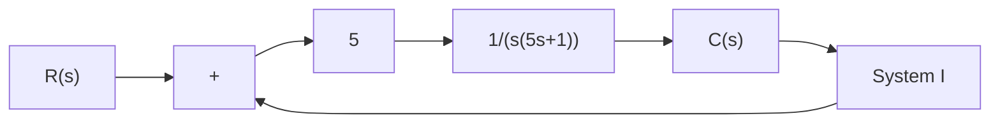
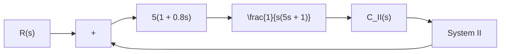
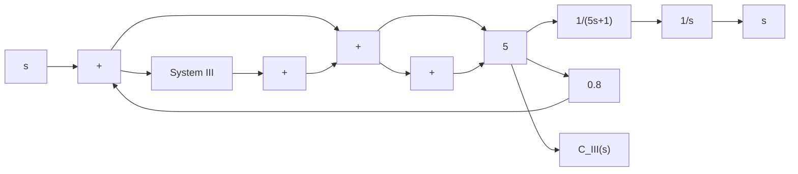
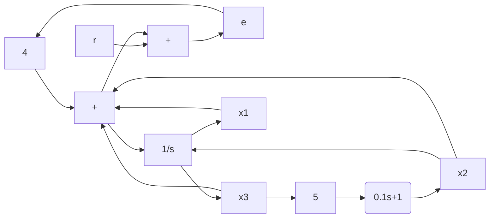

```mermaid
graph LR
    R["s"] --> |+| A["+"]
    A --> |+| B["+"]
    B --> |16/(s + 0.8)| C["1/s"]
    C --> C["s"]
    C --> |k| A
```
</details>

Figure 5–76   
Block diagram of a system.

B–5–13. Figure 5–77 shows three systems. System I is a positional servo system. System II is a positional servo system with PD control action. System III is a positional servo system with velocity feedback. Compare the unit-step, unitimpulse, and unit-ramp responses of the three systems. Which system is best with respect to the speed of response and maximum overshoot in the step response?

B–5–14. Consider the position control system shown in Figure 5–78. Write a MATLAB program to obtain a unit-step response and a unit-ramp response of the system. Plot curves $x _ { 1 } ( t )$ versus $t , x _ { 2 } ( t )$ versus $t , x _ { 3 } ( t )$ versus t, and $e ( t )$ versus t Cwhere $e ( t ) = r ( t ) - x _ { 1 } ( t ) { \big ] }$ for both the unit-step response and the unit-ramp response.


<details>
<summary>flowchart</summary>


</details>


<details>
<summary>flowchart</summary>


</details>


<details>
<summary>flowchart</summary>


</details>

Figure 5–77 Positional servo system (System I), positional servo system with PD control action (System II), and positional servo system with velocity feedback (System III).


<details>
<summary>flowchart</summary>


</details>

Figure 5–78 Position control system.
